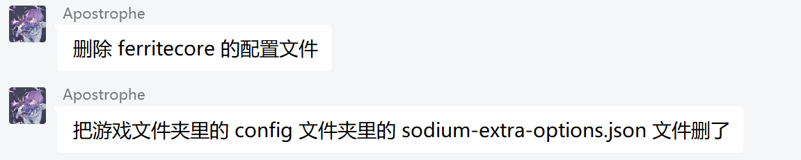

# 如何打开配置文件夹

你可能收到这样的指示：

此时你需要找到存放"配置文件"的文件夹，"config"文件夹。

打开HMCL，点击左侧的"版本管理"

**请先确保你在"版本管理"中选中了出现问题的游戏版本**

点击左下角的浏览，选中"配置文件夹"，此时会跳出一个新的文件夹。

此时回到大夫给你的信息，删除指定的文件即可

请注意，配置文件可能有多个，也可能是文件夹形式，此时请一并删除。

**请注意操作不一定能解决问题，若出现新问题请回到崩溃群。**