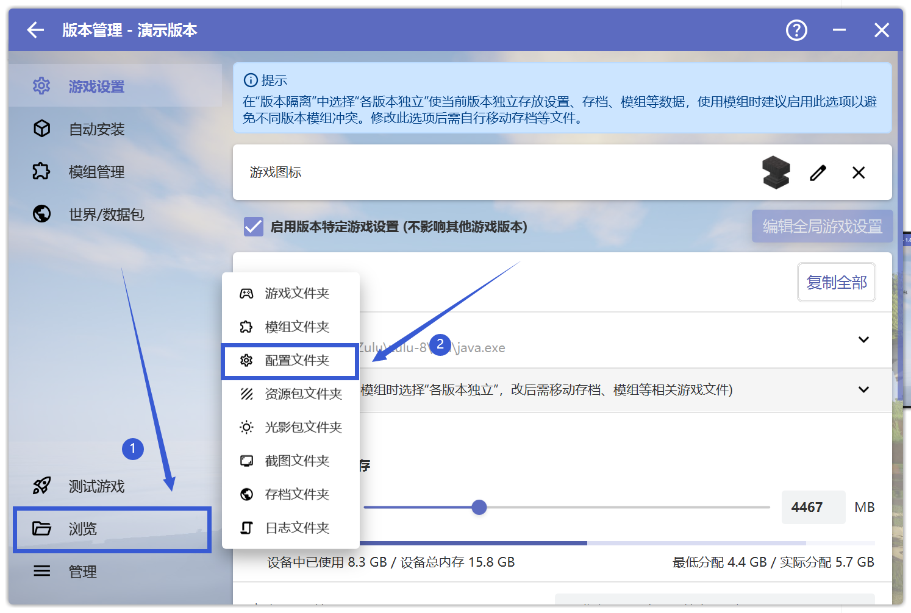

# 配置文件 问题相关

## 打开配置文件夹

首先打开HMCL启动器，点击"版本管理"
 

 

**请先确保你在"版本管理"中选中了出现问题的游戏版本**

点击左下角的浏览，选中"配置文件夹"，此时会跳出一个新的文件夹。
 

 

## 删除对应的配置文件

一般情况下，要求删除的模组的配置文件，在配置文件夹中都能找到相同的名字
 

 

如要求删除模组"ferritecore"的配置文件，在配置文件夹中一般能找到同样名字的配置文件
 

 

删除该文件即可，请注意不要使用文件资源管理器的"搜索"功能，推荐手动寻找

请注意，配置文件可能有多个，也可能是文件夹形式，此时请一并删除。

**请注意操作不一定能解决问题，若出现新问题请回到崩溃群。**

**若你对操作过程有任何疑问，请前往用户群询问，而不是崩溃群**

| 用户群       | 群号       |
| ------------ | ---------- |
| HMCL 用户群 ① | 633640264  |
| HMCL 用户群 ② | 203232161  |
| HMCL 用户群 ③ | 201034984  |
| HMCL 用户群 ④ | 533529045  |
| HMCL 用户群 ⑤ | 744304553  |
| HMCL 用户群 ⑥ | 282845310  |
| HMCL 用户群 ⑦ | 482624681  |
| HMCL 用户群 ⑧ | 991620626  |
| HMCL 用户群 ⑨ | 657677715  |
| HMCL 用户群 ⑩ | 775084843  |