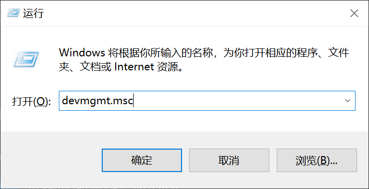
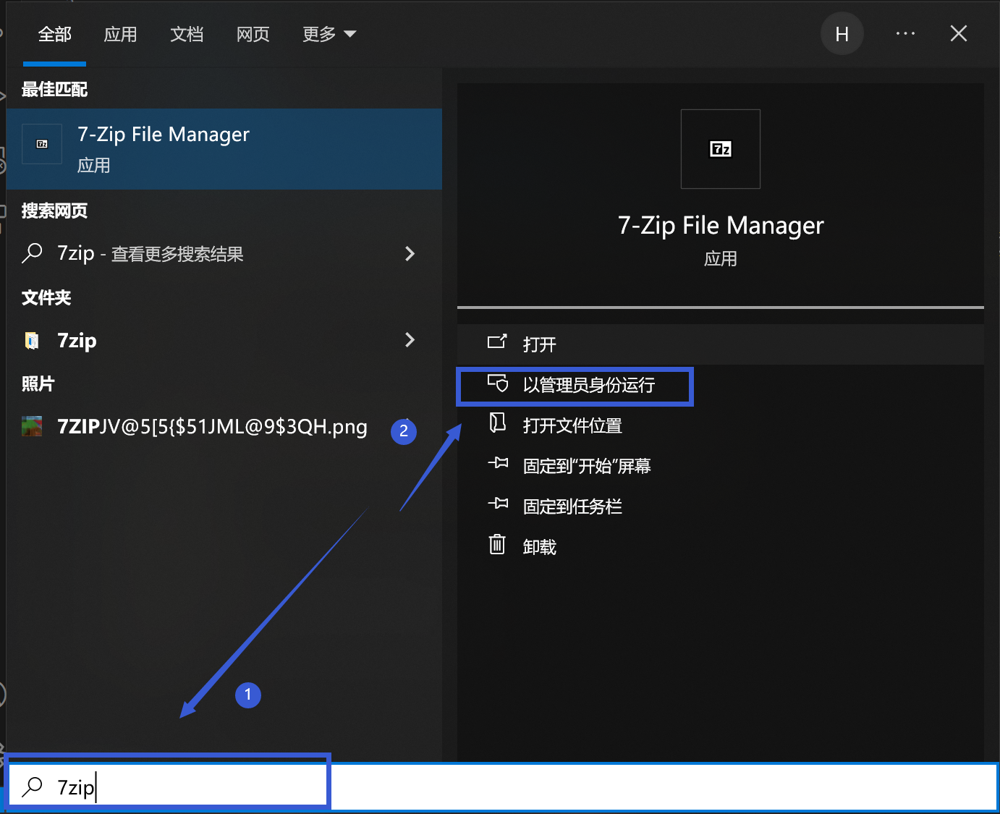
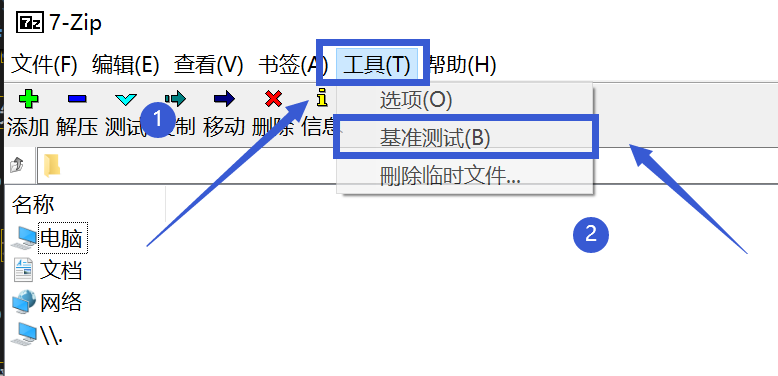
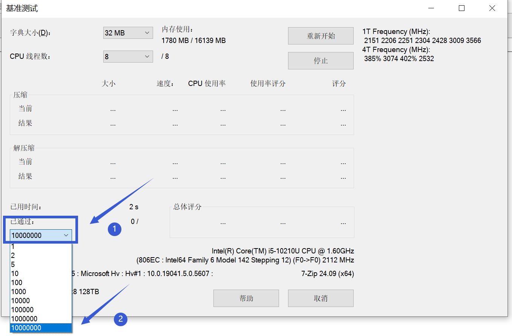

# 处理器 问题相关

## Windows查看处理器

**如果你是在崩溃群被要求查看处理器，请严格按照此条操作！**

**此方法适用于从Windows XP到Windows 11之间的任何Windows系统**

首先同时按下键盘上的Windows键和R键，打开"运行"窗口，并输入"devmgmt.msc"(不包括引号)，并按下回车，打开"设备管理器"

 

 

在新打开的页面中，找到"处理器"，展开该项后，完整截图并发送到崩溃群中。

## 基准测试

首先安装这个软件：

https://www.7-zip.org/a/7z2409-x64.exe

安装完成后，同时按下键盘上的Windows键和S键，打开"Windows搜索"，搜索"7zip"，并"以管理员身份运行"

 

 

然后在新打开的页面先点最上方的"工具"，再点"基准测试"

 

 

然后在新打开的页面展开左下方的"已通过"，并将数字改为最大，然后然后先让它运行个半小时看看会不会报错

 

 

如果发生了报错，请将报错**完整截图**后发送到报错群。

**对于操作有疑问，请前往用户群询问，而不是在崩溃群**

| 用户群       | 群号       | 用户群       | 群号       |
| ------------ | ---------- | ------------ | ---------- |
| HMCL 用户群 ① | 633640264  | HMCL 用户群 ② | 203232161  |
| HMCL 用户群 ③ | 201034984  | HMCL 用户群 ④ | 533529045  |
| HMCL 用户群 ⑤ | 744304553  | HMCL 用户群 ⑥ | 282845310  |
| HMCL 用户群 ⑦ | 482624681  | HMCL 用户群 ⑧ | 991620626  |
| HMCL 用户群 ⑨ | 657677715  | HMCL 用户群 ⑩ | 775084843  |