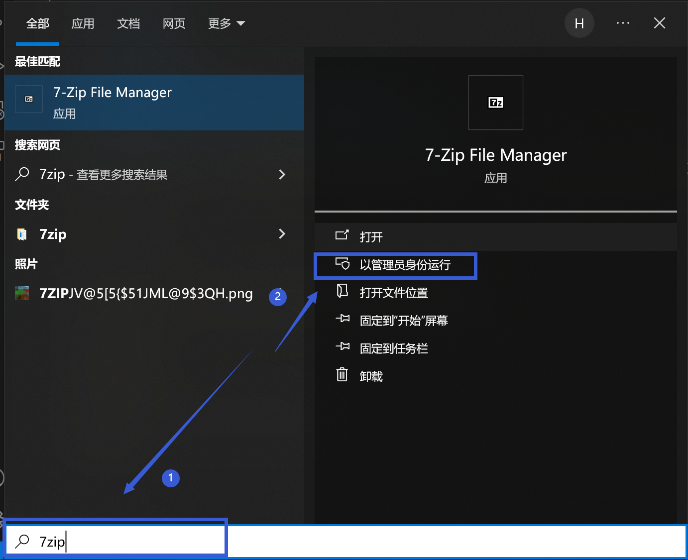
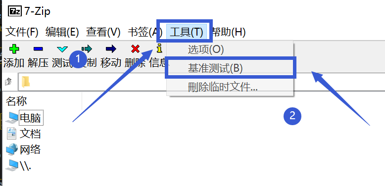
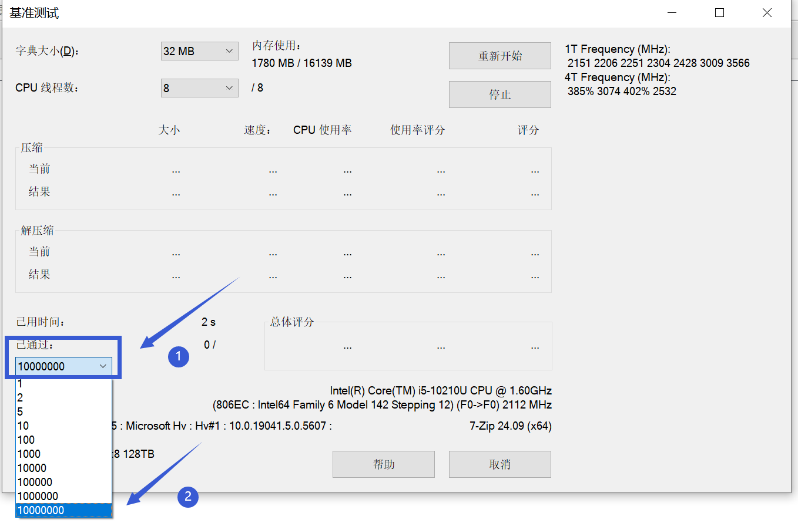

# 基准测试

---

首先安装这个软件：

https://www.7-zip.org/a/7z2409-x64.exe

安装完成后，同时按下键盘上的Windows键和S键，打开"Windows搜索"，搜索"7zip"，并"以管理员身份运行"

 

 

然后在新打开的页面先点最上方的"工具"，再点"基准测试"

 

 

然后在新打开的页面展开左下方的"已通过"，并将数字改为最大，然后然后先让它运行个半小时看看会不会报错

 

 

如果发生了报错，请将报错**完整截图**后发送到报错群。

