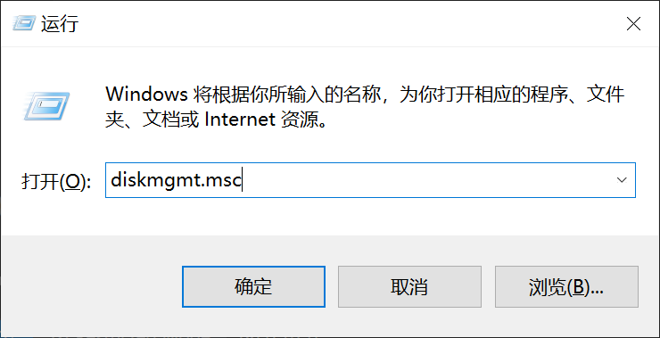
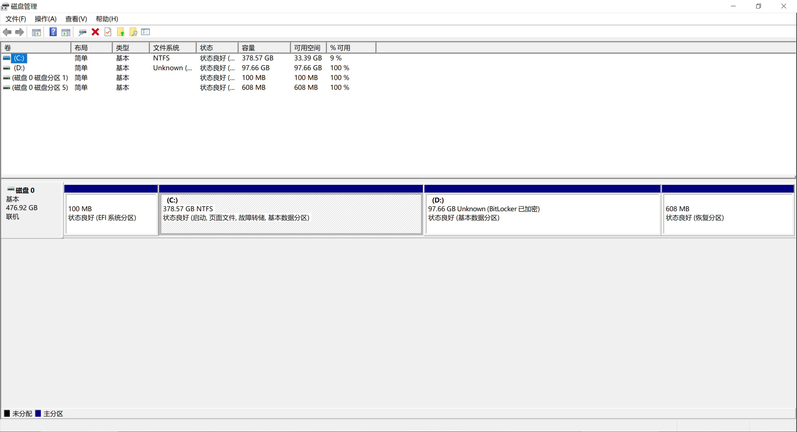

# 如何打开磁盘管理

首先同时按下键盘上的Windows键和R键，打开"运行"窗口，并输入"diskmgmt.msc"(不包括引号)，并按下回车，打开"磁盘管理"

 

 

窗口最大化后，将新打开的页面截图并发至崩溃群

 

 

**若你对操作过程有任何疑问，请前往用户群询问，而不是崩溃群**

| 用户群       | 群号       | 用户群       | 群号       |
| ------------ | ---------- | ------------ | ---------- |
| HMCL 用户群 ① | 633640264  | HMCL 用户群 ② | 203232161  |
| HMCL 用户群 ③ | 201034984  | HMCL 用户群 ④ | 533529045  |
| HMCL 用户群 ⑤ | 744304553  | HMCL 用户群 ⑥ | 282845310  |
| HMCL 用户群 ⑦ | 482624681  | HMCL 用户群 ⑧ | 991620626  |
| HMCL 用户群 ⑨ | 657677715  | HMCL 用户群 ⑩ | 775084843  |