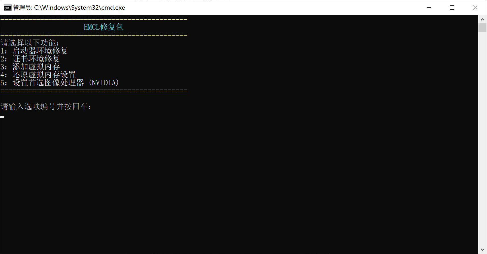

# 启动器环境 问题相关

## Windows 用户

**此脚本仍在测试，若你遇到任何问题请向崩溃群报告！**

下载这个脚本：https://gitee.com/hylfrd/hmcl-helper/releases/download/1.0.0/hmcl-helper.zip 下载后**解压**并运行其中的 run.bat脚本

在新跳出来的界面使用功能1并按提示执行

 

 

**如果发现脚本试图卸载非Java程序，请不要执行并向崩溃群报告**

 

## MacOS 用户

首先确认你的电脑是ARM架构还是x86架构，如果你使用的是M系列CPU则为ARM架构，如果你使用的是Intel系列CPU则为x86架构

按照你的架构，选择下面的链接下载Java并安装

ARM架构: https://download.bell-sw.com/java/11.0.27+9/bellsoft-jdk11.0.27+9-macos-aarch64.dmg

x86架构: https://download.bell-sw.com/java/11.0.27+9/bellsoft-jdk11.0.27+9-macos-amd64.dmg

**请注意操作不一定能解决问题，若出现新问题请回到崩溃群。**

**若你对操作过程有任何疑问，请前往用户群询问，而不是崩溃群**

| 用户群       | 群号       | 用户群       | 群号       |
| ------------ | ---------- | ------------ | ---------- |
| HMCL 用户群 ① | 633640264  | HMCL 用户群 ② | 203232161  |
| HMCL 用户群 ③ | 201034984  | HMCL 用户群 ④ | 533529045  |
| HMCL 用户群 ⑤ | 744304553  | HMCL 用户群 ⑥ | 282845310  |
| HMCL 用户群 ⑦ | 482624681  | HMCL 用户群 ⑧ | 991620626  |
| HMCL 用户群 ⑨ | 657677715  | HMCL 用户群 ⑩ | 775084843  |