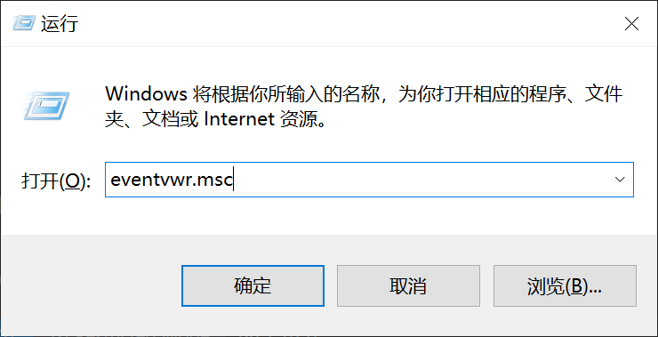
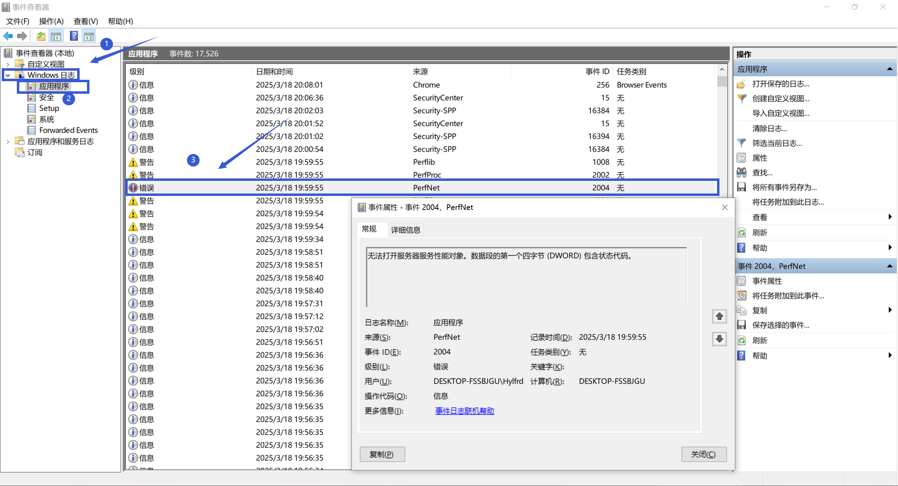
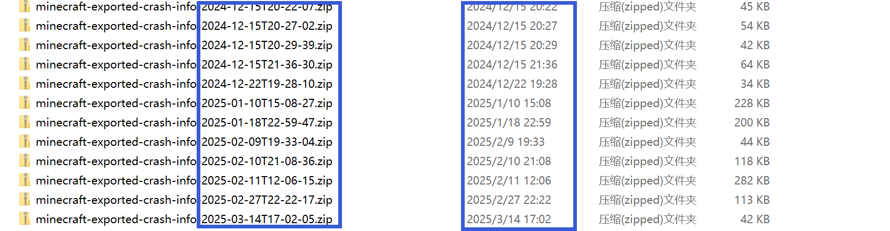

# 事件查看器 问题相关

## Windows打开事件查看器

**如果你是在崩溃群被要求查看"错误"事件，请严格按照此条操作！**

**此方法适用于从Windows XP到Windows 11之间的任何Windows系统**

首先同时按下键盘上的Windows键和R键，打开"运行"窗口，并输入"eventvwr.msc"(不包括引号)，并按下回车，打开"事件查看器"

 

 

然后按下图的顺序，先展开左侧的"Windows日志"，在展开的选项中点击"应用程序"，再双击你看到的"错误"事件并截图(下面的示例图与Minecraft报错无关，仅作示例用)

 

 

将截图发送至崩溃群供大夫判断

**若存在多个"错误"事件**，选择与你游戏崩溃时间最接近的错误事件。如果你忘记了游戏崩溃的时间，可以找到你上传的日志压缩包，其中压缩包的名字记录的时间，和压缩包的修改时间为你导出崩溃信息的时间，与你游戏崩溃的时间较为相近。如果你仍不清楚，可以到崩溃群中截图事件查看器的界面，询问群内的大夫。

 

 

**请务必完整截图！**