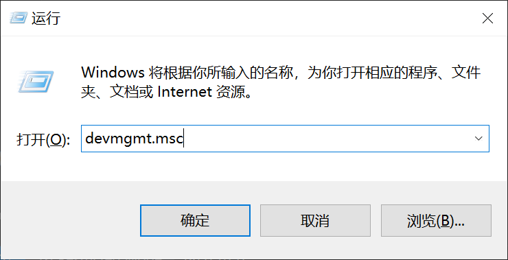
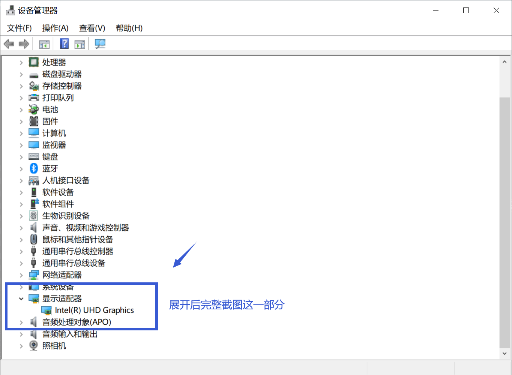

# 显卡 问题相关

## Windows查看显卡

**如果你是在崩溃群被要求查看显卡，请严格按照此条操作！**

**此方法适用于从Windows XP到Windows 11之间的任何Windows系统**

首先同时按下键盘上的Windows键和R键，打开"运行"窗口，并输入"devmgmt.msc"(不包括引号)，并按下回车，打开"设备管理器"

 

 

在新打开的页面中，找到"显示适配器"，展开该项后，完整截图并发送到崩溃群中。

 

 

