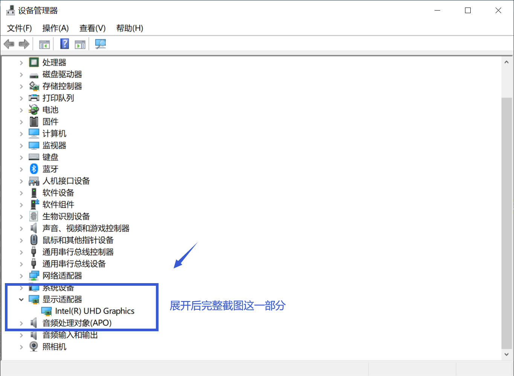
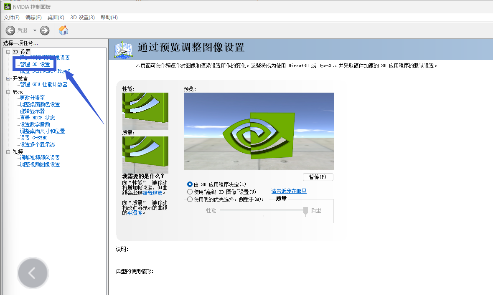
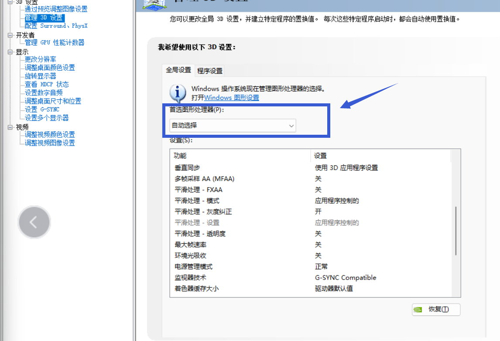
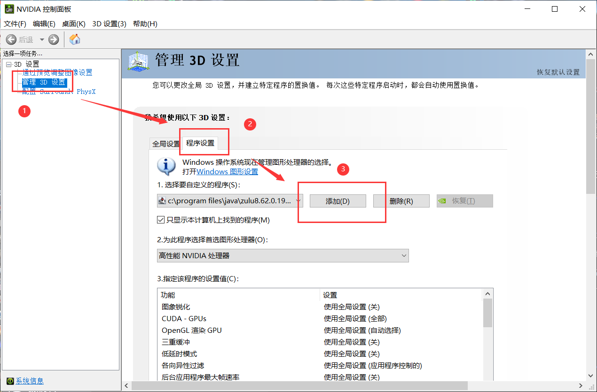
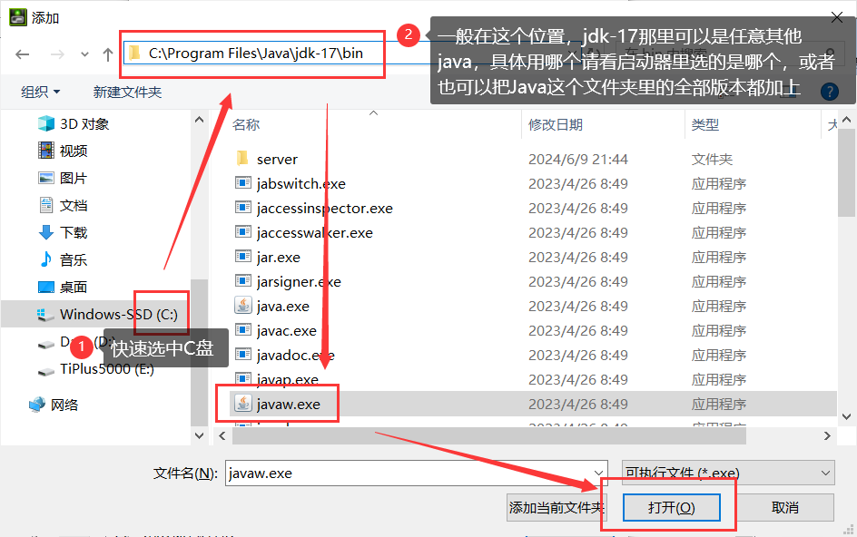
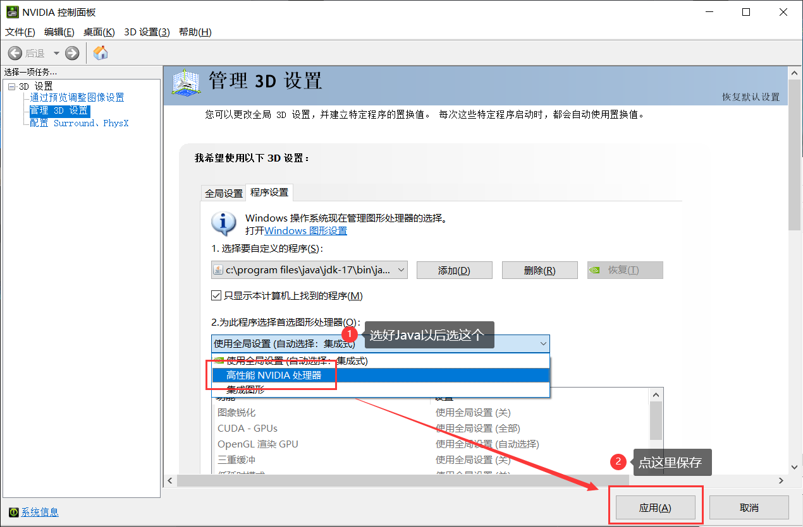

# 显卡 问题相关

## Windows查看显卡

**如果你是在崩溃群被要求查看显卡，请严格按照此条操作！**

**此方法适用于从Windows XP到Windows 11之间的任何Windows系统**

首先同时按下键盘上的Windows键和R键，打开"运行"窗口，并输入"devmgmt.msc"(不包括引号)，并按下回车，打开"设备管理器"

 

 

在新打开的页面中，找到"显示适配器"，展开该项后，完整截图并发送到崩溃群中。

 

 

## Nvidia显卡 打开高性能

首先右键点击桌面，点击"Nvidia控制面板"，然后点击"管理3D设置"

 

 

下拉右侧"首选图形处理器"后，选择"高性能NVIDIA处理器"，最后重启电脑

 

 
 

**如果你找不到"首选图形处理器"，请按照下面的教程操作**

 

 

 

 

 

按照上述操作后，重启电脑

**对于操作有疑问，请前往用户群询问，而不是在崩溃群**

| 用户群       | 群号       | 用户群       | 群号       |
| ------------ | ---------- | ------------ | ---------- |
| HMCL 用户群 ① | 633640264  | HMCL 用户群 ② | 203232161  |
| HMCL 用户群 ③ | 201034984  | HMCL 用户群 ④ | 533529045  |
| HMCL 用户群 ⑤ | 744304553  | HMCL 用户群 ⑥ | 282845310  |
| HMCL 用户群 ⑦ | 482624681  | HMCL 用户群 ⑧ | 991620626  |
| HMCL 用户群 ⑨ | 657677715  | HMCL 用户群 ⑩ | 775084843  |