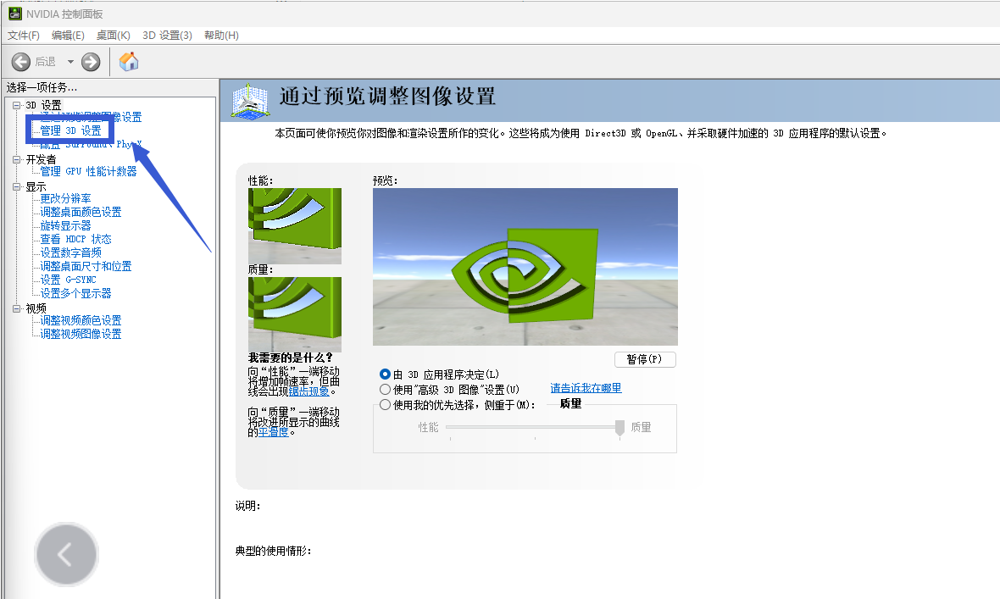
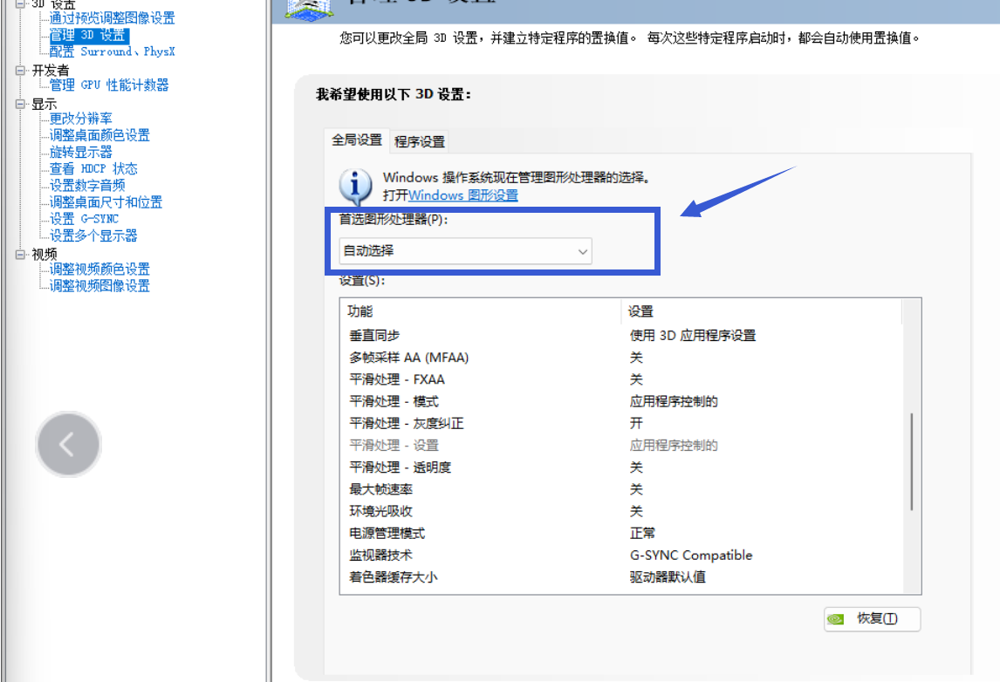
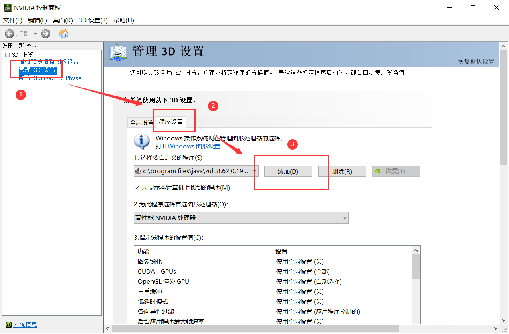
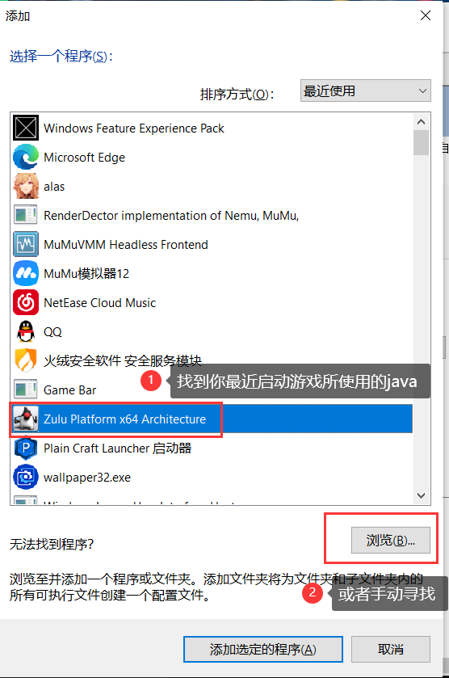
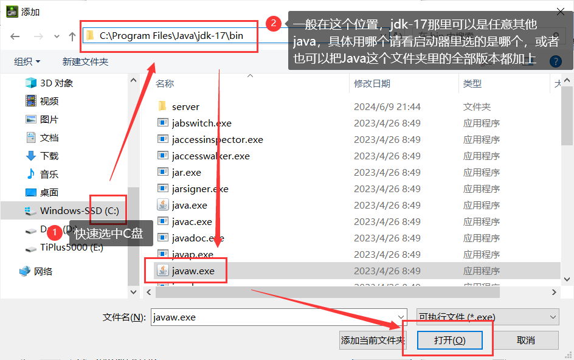
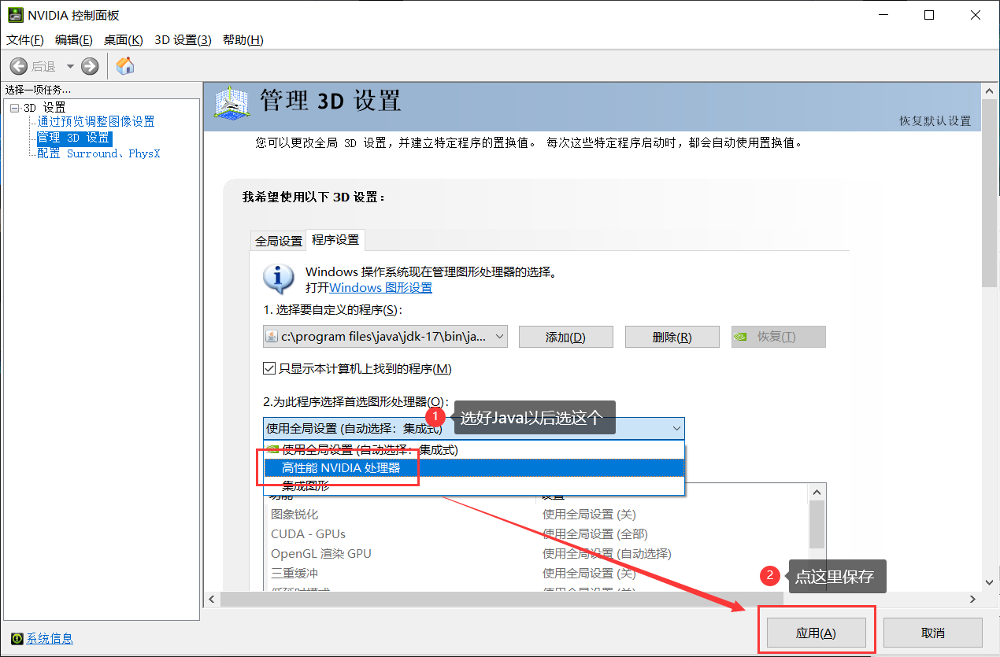

# 英伟达独显直连

首先右键点击桌面，点击"Nvidia控制面板"，然后点击"管理3D设置"

 

 

下拉右侧"首选图形处理器"后，选择"高性能NVIDIA处理器"，最后重启电脑

 

 

**如果提示"拒绝访问"**

 

请尝试以下步骤：

1：使用管理员模式启动英伟达显卡控制面板 
2：升级/降级你的英伟达显卡驱动

 

**如果你找不到"首选图形处理器"，请按照下面的教程操作**

 

 

 

 

 

按照上述操作后，重启电脑

**对于操作有疑问，请前往用户群询问，而不是在崩溃群**

| 用户群       | 群号       | 用户群       | 群号       |
| ------------ | ---------- | ------------ | ---------- |
| HMCL 用户群 ① | 633640264  | HMCL 用户群 ② | 203232161  |
| HMCL 用户群 ③ | 201034984  | HMCL 用户群 ④ | 533529045  |
| HMCL 用户群 ⑤ | 744304553  | HMCL 用户群 ⑥ | 282845310  |
| HMCL 用户群 ⑦ | 482624681  | HMCL 用户群 ⑧ | 991620626  |
| HMCL 用户群 ⑨ | 657677715  | HMCL 用户群 ⑩ | 775084843  |