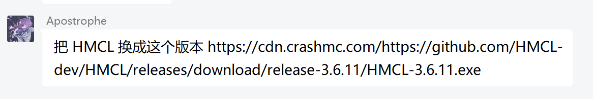
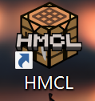

# 如何安装 HMCL

你可能在崩溃群中，收到了这样的指示，要求你更换HMCL启动器的版本：

这说明你的崩溃或启动器问题，可能因为你的启动器版本过老，需要通过更换HMCL启动器的版本来解决。

首先你可以通过下面链接访问HMCL:（截至2025年3月17日最新版本）

Github仓库链接：https://github.com/HMCL-dev/HMCL/releases/download/release-3.6.11/HMCL-3.6.11.exe 
镜像链接（上面链接无法下载或过慢使用这个）：https://cdn.crashmc.com/https://github.com/HMCL-dev/HMCL/releases/download/release-3.6.11/HMCL-3.6.11.exe

然后你需要前往你的游戏目录，即你打开游戏的文件夹，他可能长这个样子：

文件夹应包含HMCL启动器，以及”.minecraft"文件夹，可能还有其他的文件。

此时将你刚刚下载好的启动器，复制粘贴到你的游戏目录的文件夹，并使用你刚刚复制粘贴的新版启动器启动游戏。

你可以删除原来的旧版启动器。

**如果你发现你的启动器在桌面......**

这说明你的启动器是快捷方式，此时右键这个快捷方式，选择"打开文件所在的位置"，你就可以找到你的游戏目录了。

**请注意更新启动器版本不一定能解决问题，若出现新问题请回到崩溃群**

 

