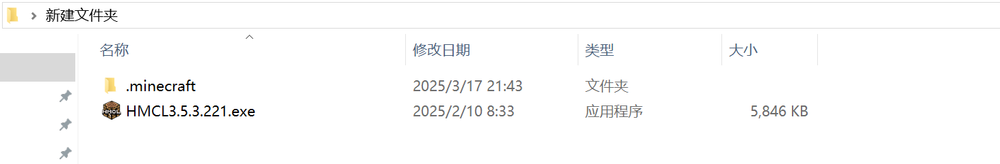
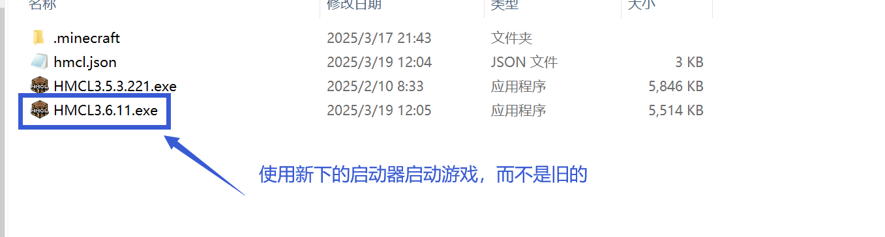
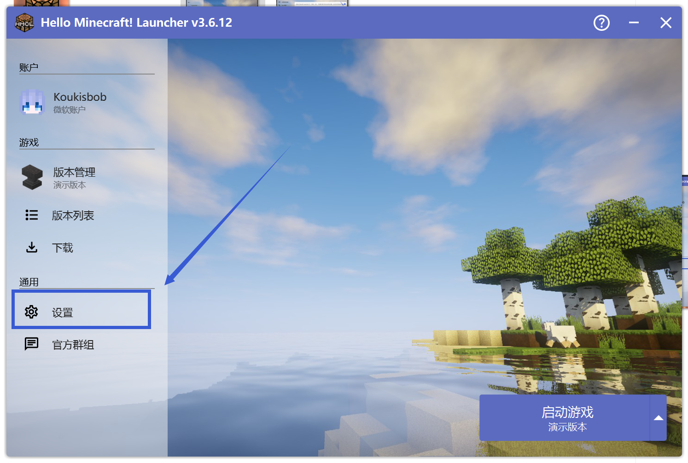
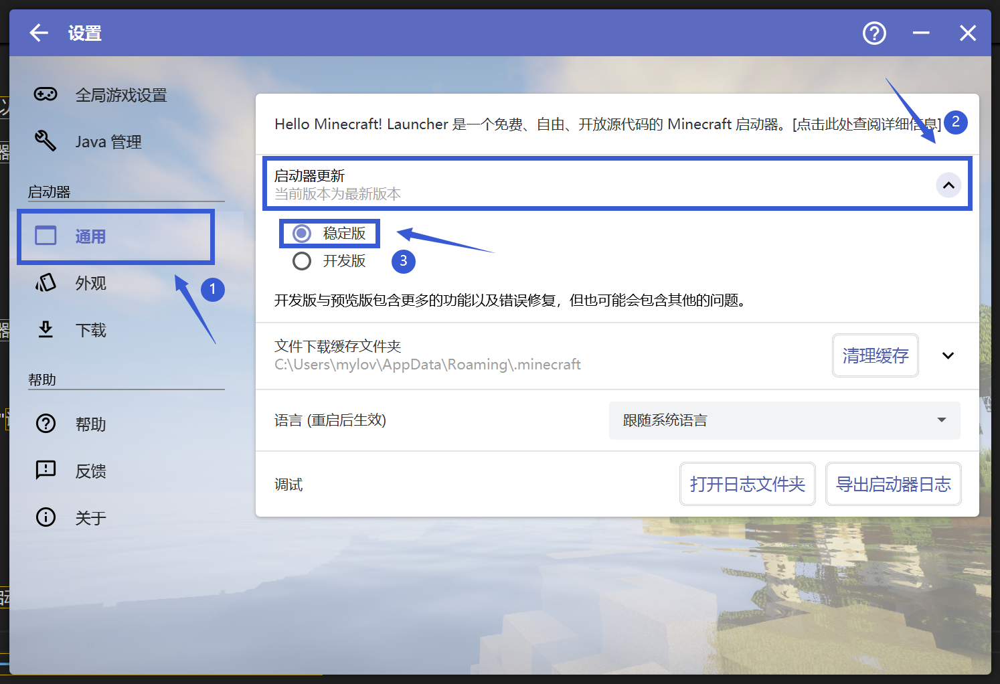

# HMCL更新问题

## 如何手动更新HMCL

首先你可以通过下面链接访问HMCL:（截至2025年3月19日最新版本）

Github仓库链接：https://github.com/HMCL-dev/HMCL/releases/download/release-3.6.11/HMCL-3.6.11.exe 
镜像链接（上面链接无法下载或过慢使用这个）：https://cdn.crashmc.com/https://github.com/HMCL-dev/HMCL/releases/download/release-3.6.11/HMCL-3.6.11.exe

然后你需要前往你的游戏目录，即你打开游戏的文件夹。下图为一种示例：

 

 

文件夹应包含HMCL启动器，以及”.minecraft"文件夹，可能还有其他的文件。

此时将你刚刚下载好的启动器，复制粘贴到你的游戏目录的文件夹，并使用你刚刚复制粘贴的新版启动器启动游戏。

 

 

你可以删除原来的旧版启动器。

## 如何自动更新 HMCL

首先打开HMCL启动器，点击"设置"

 

 

点击"通用"，下拉左边的"启动器更新"，选择"稳定版"

 

 

启动器会自动检测可用的更新，若有更新安装即可。

**请注意更新启动器版本不一定能解决问题，若出现新问题请回到崩溃群**

**若你对更新过程有任何疑问，请前往用户群询问，而不是崩溃群**

| 用户群       | 群号       |
| ------------ | ---------- |
| HMCL 用户群 ① | 633640264  |
| HMCL 用户群 ② | 203232161  |
| HMCL 用户群 ③ | 201034984  |
| HMCL 用户群 ④ | 533529045  |
| HMCL 用户群 ⑤ | 744304553  |
| HMCL 用户群 ⑥ | 282845310  |
| HMCL 用户群 ⑦ | 482624681  |
| HMCL 用户群 ⑧ | 991620626  |
| HMCL 用户群 ⑨ | 657677715  |
| HMCL 用户群 ⑩ | 775084843  |
