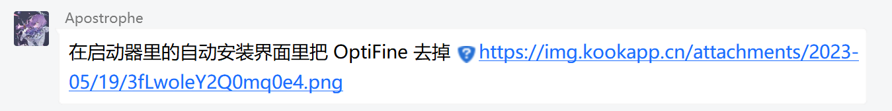
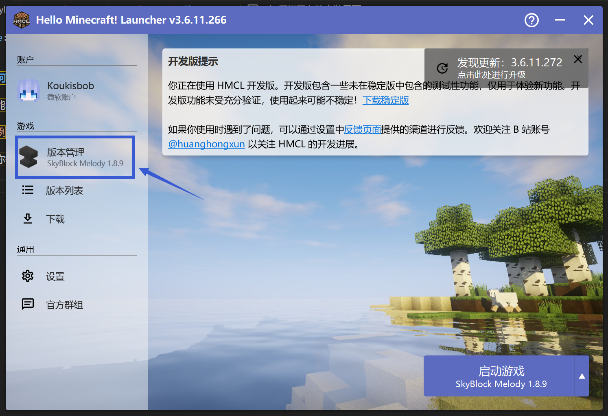
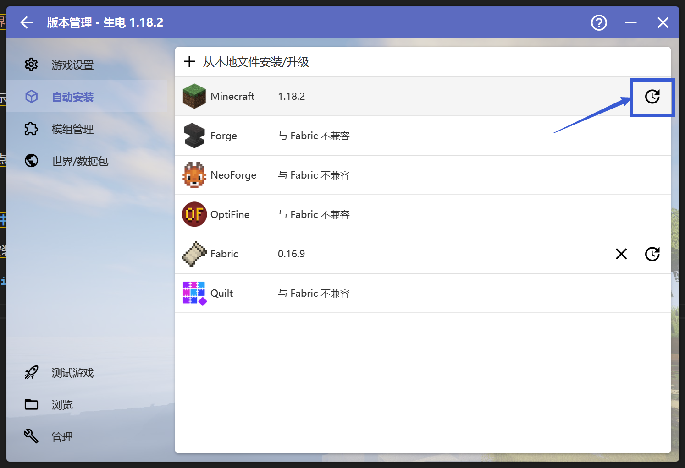
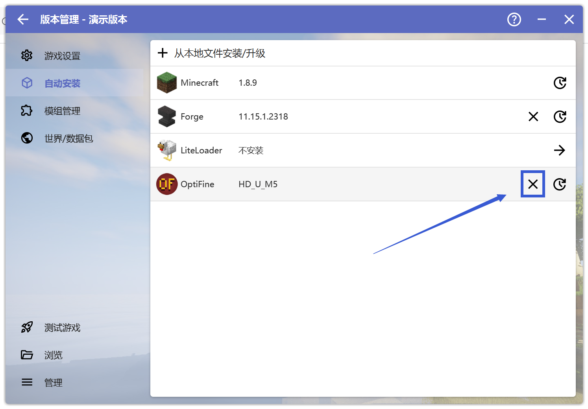

# 如何打开自动安装界面

你可能收到了下图大夫的指示：

此时你需要先打开启动器，点击左侧的"版本管理":

**请先确保你在"版本管理"中选中了出现问题的游戏版本**

你就可以看到左侧的"自动安装"了，双击打开自动安装，并回到大夫给出的信息继续操作。

## 更换Forge/Fabric/Optifine版本

点击你需要更换的选项(图中以Forge为例)，并点击右边的小时钟按钮

选择大夫让你更换的版本，安装即可。

## 去掉Optifine

直接点击Optifine右边的"叉号"即可。

**请注意操作不一定能解决问题，若出现新问题请回到崩溃群。**