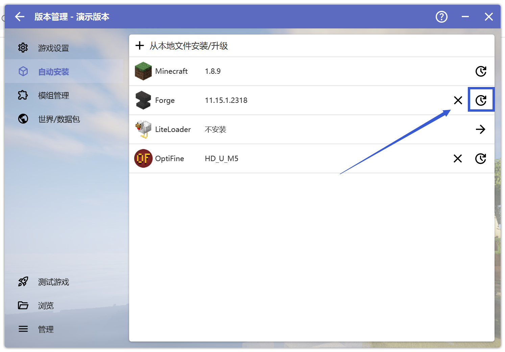

# 自动安装界面 问题相关

## 打开自动安装界面

 

 

此时你需要先打开启动器，点击左侧的"版本管理":

 

 

**请先确保你在"版本管理"中选中了出现问题的游戏版本**

你就可以看到左侧的"自动安装"了，单击即可打开自动安装界面。

## 更换Forge/Fabric/Optifine版本

 

 

点击你需要更换的选项(图中以Forge为例)，并点击右边的小时钟按钮

选择大夫让你更换的版本，安装即可。

## 去掉Optifine

 

 

直接点击Optifine右边的"叉号"即可。

**请注意操作不一定能解决问题，若出现新问题请回到崩溃群。**