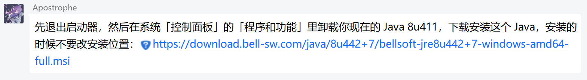
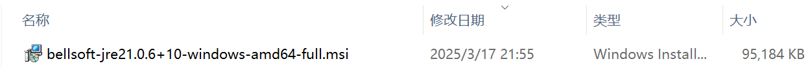
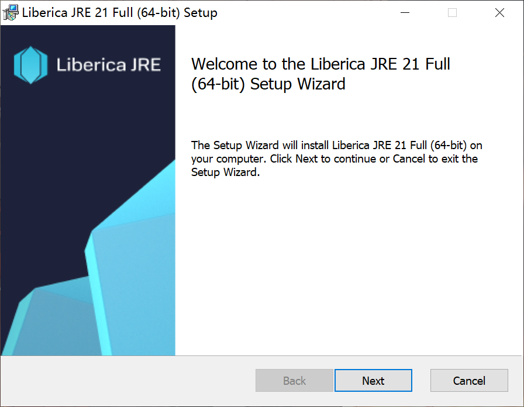
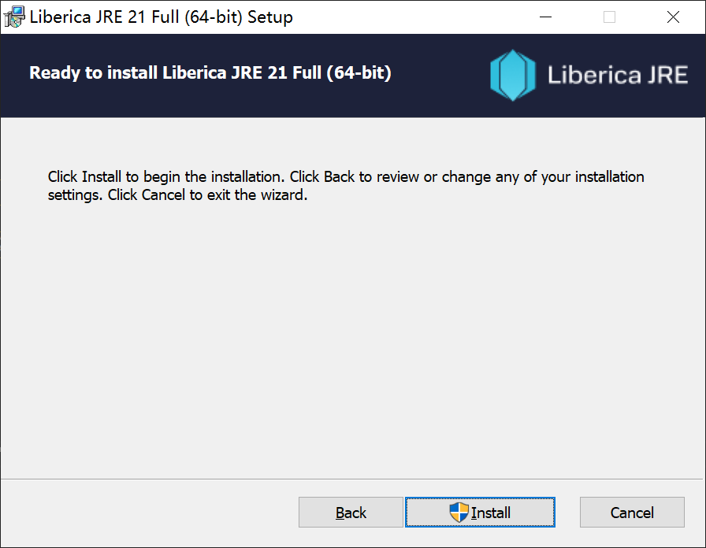
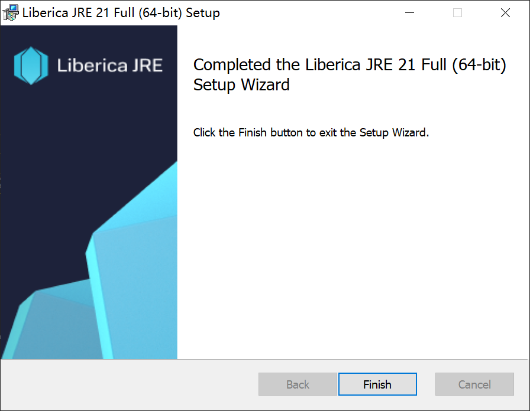
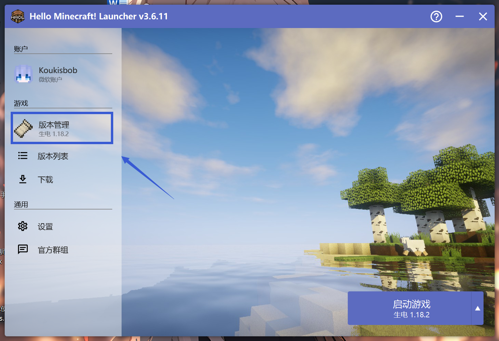
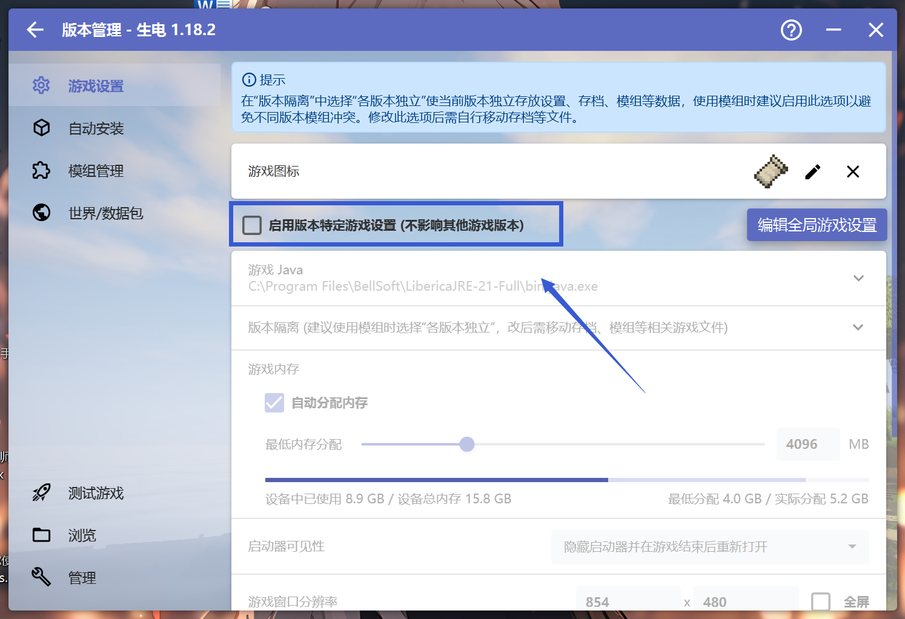
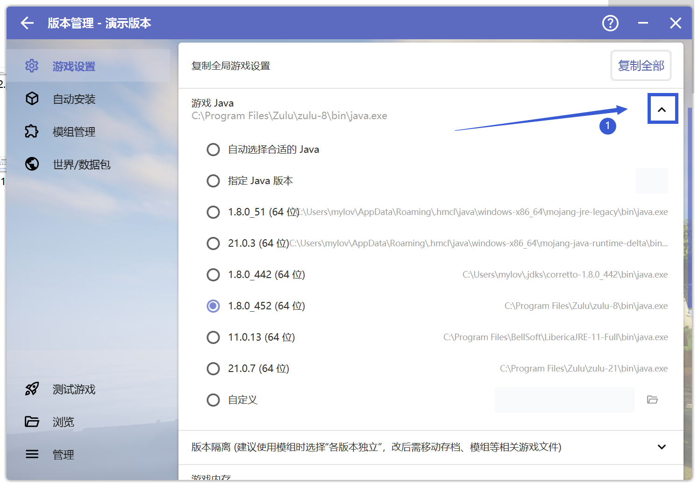
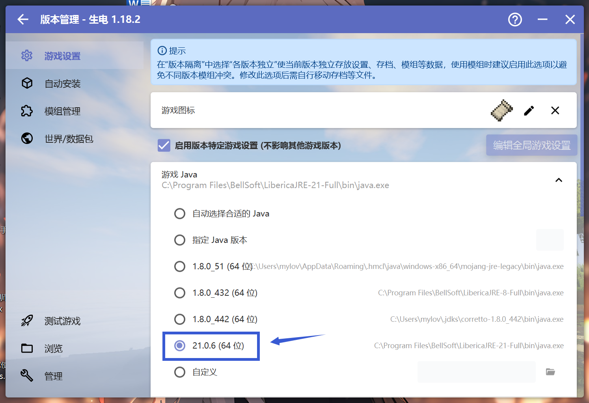

# 卸载Java

此时按下键盘上的Windows+R，输入"control"并回车，点击"程序"下方的"卸载程序"，在其中找到大夫让你卸载的Java并卸载

# 安装Java

先点击第一个链接下载需要安装的java。

当你下载完之后，你会在"下载"文件夹得到长这个样子的文件： （后文以bellsoft java21为安装示例）

双击打开安装包，你会看到这样的全英文界面：

此时请一直点击中间的第三个按钮"Next"，并会最终看到"Install"

当出现下图时则说明安装成功了！

# 更改游戏Java特定版本

先点击"版本管理"

再点击"启用版本特定游戏设置(不影响其他版本游戏)

下拉"游戏Java"选项，切换Java为群中大夫需要你更改的Java版本

以下为一个示例：如群中大夫要求"把 Java 路径改成 21.0.6 版本"，则选择"21.0.6的Java：

**请注意更换Java版本不一定能解决问题，若出现新的问题请回到崩溃群**

