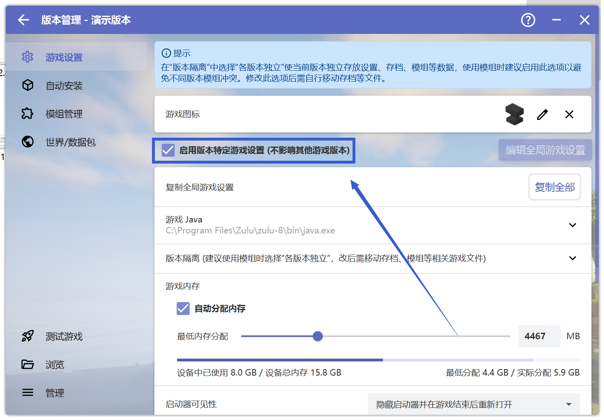

# Java问题相关

## 卸载Java

此时按下键盘上的Windows+R，输入"control"并回车，点击"程序"下方的"卸载程序"，在其中找到大夫让你卸载的Java并卸载

## 安装Java

 

 

先点击第一个链接下载需要安装的java。

当你下载完之后，你会在"下载"文件夹得到长这个样子的文件： （后文以bellsoft java21为安装示例）

 

 

双击打开安装包，你会看到这样的全英文界面：

 

 

此时请一直点击中间的第三个按钮"Next"，并会最终看到"Install"

 

 

当出现下图时则说明安装成功了！
 

 

## 更改游戏Java特定版本
 

首先打开HMCL启动器，点击"版本管理"
 

 
再点击"启用版本特定游戏设置(不影响其他版本游戏)
 

 

下拉"游戏Java"选项，切换Java为群中大夫需要你更改的Java版本
 

 

以下为一个示例：如群中大夫要求"把 Java 路径改成 21.0.6 版本"，则选择"21.0.6"的Java
 

 

**请注意更换Java版本不一定能解决问题，若出现新的问题请回到崩溃群**

**若你对操作过程有任何疑问，请前往用户群询问，而不是崩溃群**

HMCL 用户群 ①: 633640264    HMCL 用户群 ②: 203232161 
HMCL 用户群 ③: 201034984    HMCL 用户群 ④: 533529045 
HMCL 用户群 ⑤: 744304553    HMCL 用户群 ⑥: 282845310 
HMCL 用户群 ⑦: 482624681    HMCL 用户群 ⑧: 991620626 
HMCL 用户群 ⑨: 657677715    HMCL 用户群 ⑩: 775084843 