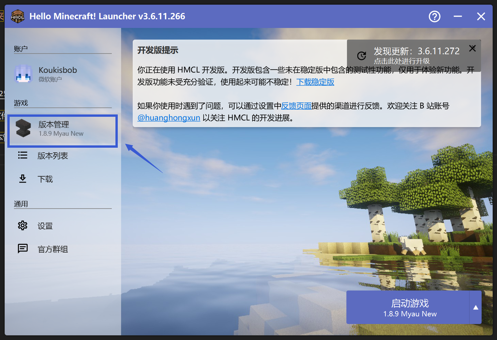
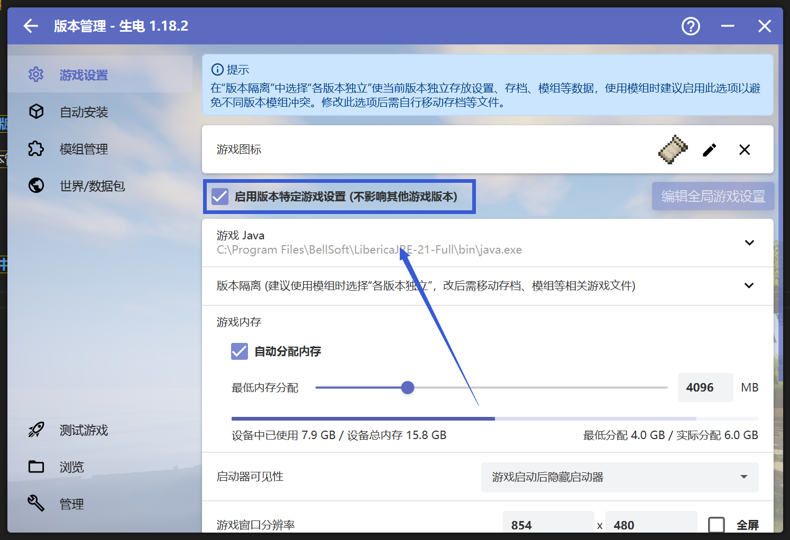
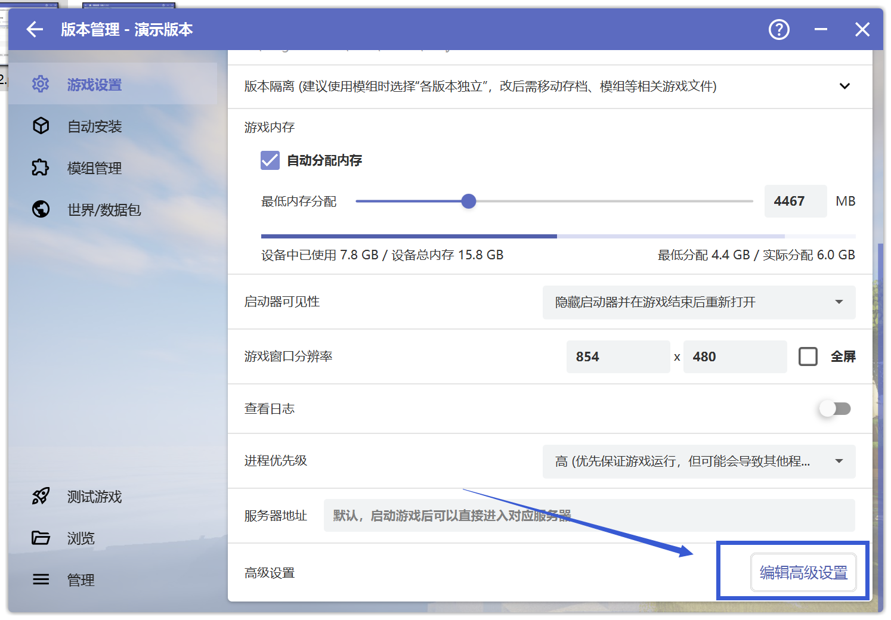
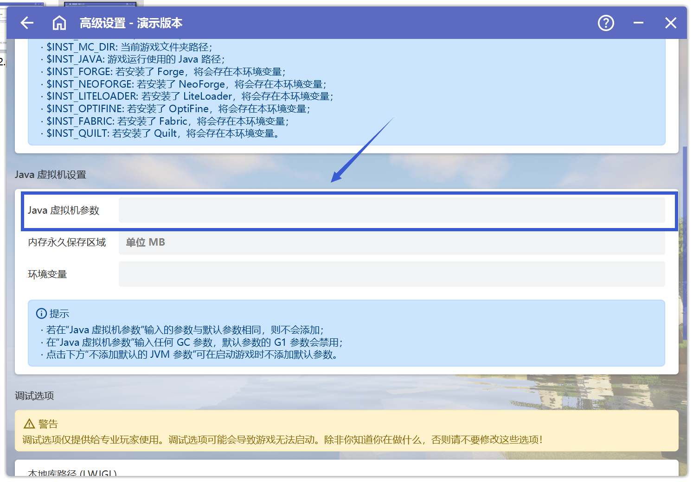

# JVM 虚拟机参数问题

## 如何添加JVM虚拟机参数

**此方法适用于HMCL启动器版本3.6.11，旧版HMCL启动器的添加方式略有不同，如果你在接下来的步骤找不到选项，请先更新HMCL启动器**

首先打开HMCL启动器，点击"版本管理"
 

 

**请先确保你在"版本管理"中选中了出现问题的游戏版本**

点击"启用版本特定游戏设置（不影响其他游戏版本）"，一直往下划，点击"编辑高级设置"

 

 
进入"高级设置"，往下划，找到"Java虚拟机设置"，在"Java虚拟机参数"一项填写需要填写的Java虚拟机参数

 

 

**请注意填写Java虚拟机参数时，请完整复制需要添加的参数，不要漏掉最前面的横杠("-")!**

**请注意操作不一定能直接解决问题，具体以崩溃群内大夫的要求为准！请仔细阅读大夫要求的每一个字！**

**若你对操作过程有任何疑问，请前往用户群询问，而不是崩溃群**

| 用户群       | 群号       | 用户群       | 群号       |
| ------------ | ---------- | ------------ | ---------- |
| HMCL 用户群 ① | 633640264  | HMCL 用户群 ② | 203232161  |
| HMCL 用户群 ③ | 201034984  | HMCL 用户群 ④ | 533529045  |
| HMCL 用户群 ⑤ | 744304553  | HMCL 用户群 ⑥ | 282845310  |
| HMCL 用户群 ⑦ | 482624681  | HMCL 用户群 ⑧ | 991620626  |
| HMCL 用户群 ⑨ | 657677715  | HMCL 用户群 ⑩ | 775084843  |
