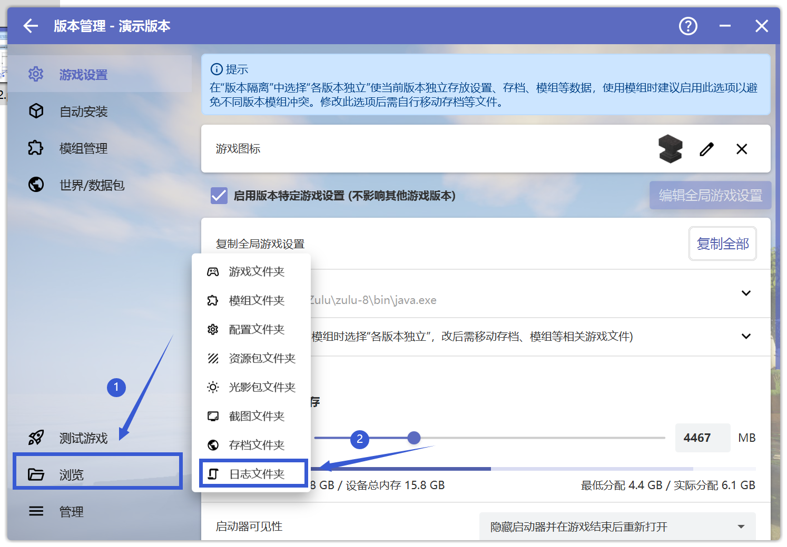

# 日志 问题相关

## 找到latest日志

首先打开HMCL启动器，点击"版本管理"

 

 

**请先确保你在"版本管理"中选中了出现问题的游戏版本**

然后先点击"浏览"，再点击"日志文件夹"

 

 

在新跳出来的文件夹页面中，找到名为"latest"的文档文件

 

将找到的文件发送至崩溃群，以供大夫判断你的崩溃问题。

## 找到debug日志

首先打开HMCL启动器，点击"版本管理"

 

 

**请先确保你在"版本管理"中选中了出现问题的游戏版本**

然后先点击"浏览"，再点击"日志文件夹"

 

 

在新跳出来的文件夹页面中，找到名为"debug"的文档文件

 

将找到的文件发送至崩溃群，以供大夫判断你的崩溃问题。

**若你对操作过程有任何疑问，请前往用户群询问，而不是崩溃群**

HMCL 用户群 ①: 633640264    HMCL 用户群 ②: 203232161
HMCL 用户群 ③: 201034984    HMCL 用户群 ④: 533529045
HMCL 用户群 ⑤: 744304553    HMCL 用户群 ⑥: 282845310
HMCL 用户群 ⑦: 482624681    HMCL 用户群 ⑧: 991620626
HMCL 用户群 ⑨: 657677715    HMCL 用户群 ⑩: 775084843