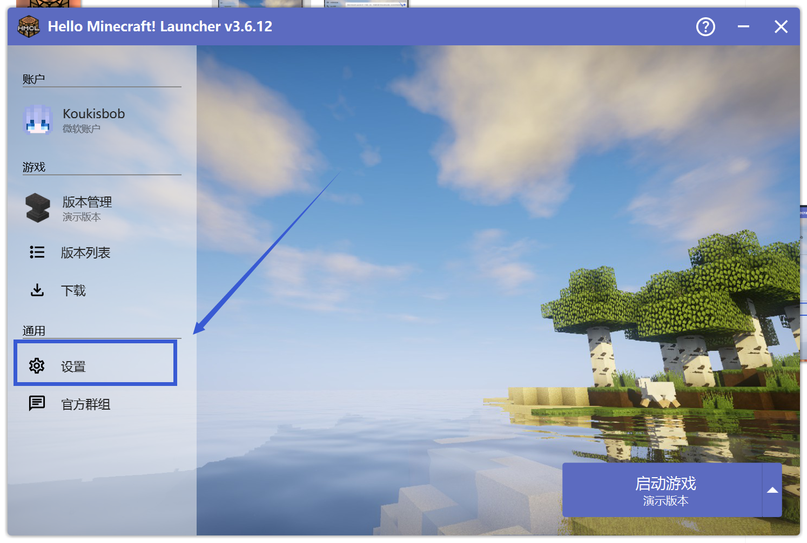

# 启动器日志问题

## 如何导出HMCL启动器日志

首先打开HMCL启动器，点击"设置"

 

 

点击"通用"，点击右侧的"导出启动器日志"，然后将导出的日志文件发送到崩溃群中，以供大夫分析

 

 

**若你对操作过程有任何疑问，请前往用户群询问，而不是崩溃群**

| 用户群       | 群号       | 用户群       | 群号       |
| ------------ | ---------- | ------------ | ---------- |
| HMCL 用户群 ① | 633640264  | HMCL 用户群 ② | 203232161  |
| HMCL 用户群 ③ | 201034984  | HMCL 用户群 ④ | 533529045  |
| HMCL 用户群 ⑤ | 744304553  | HMCL 用户群 ⑥ | 282845310  |
| HMCL 用户群 ⑦ | 482624681  | HMCL 用户群 ⑧ | 991620626  |
| HMCL 用户群 ⑨ | 657677715  | HMCL 用户群 ⑩ | 775084843  |