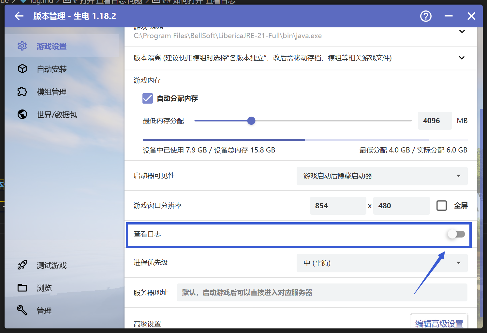
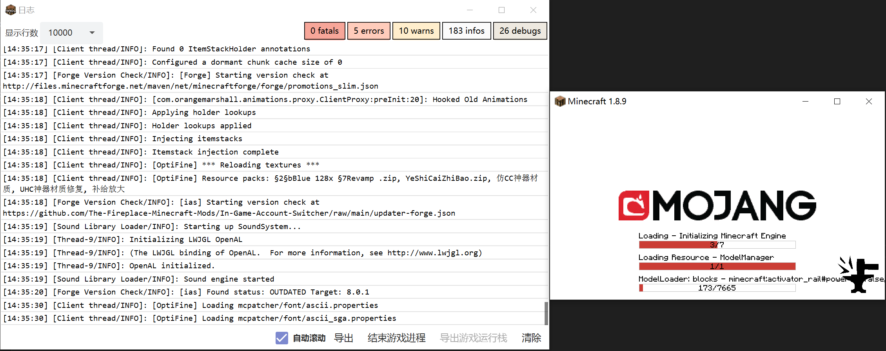
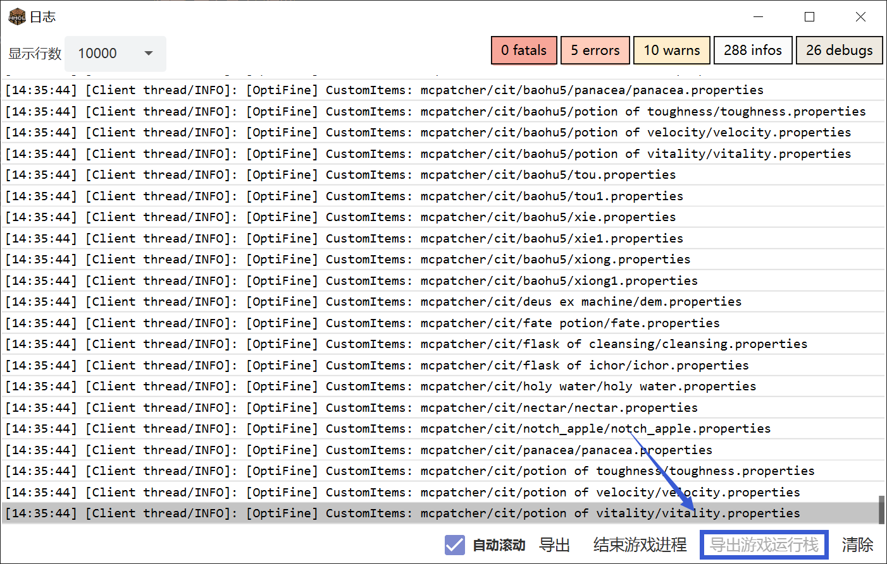
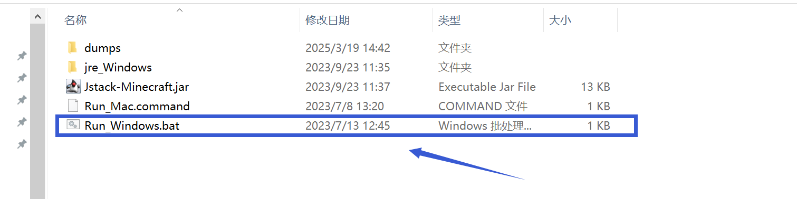
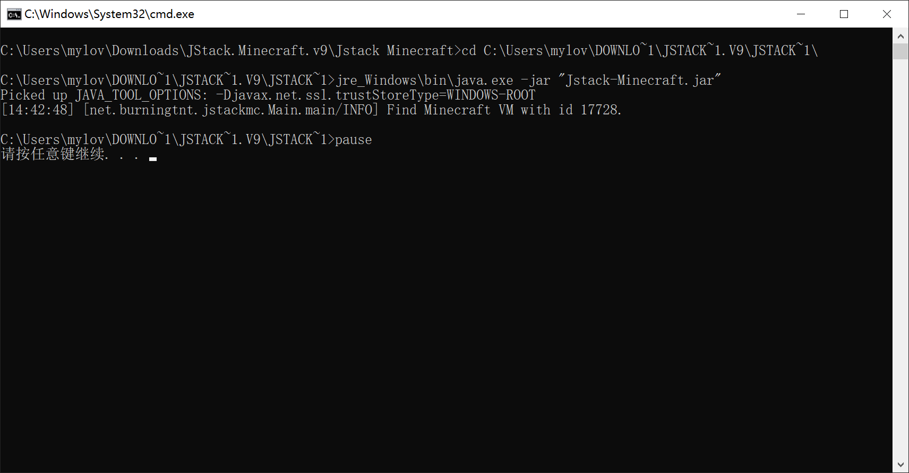

# 打开'查看日志'问题

## 如何打开"查看日志"

首先打开HMCL启动器，点击"版本管理"

 

 

**请先确保你在"版本管理"中选中了出现问题的游戏版本**

点击"启用版本特定游戏设置（不影响其他游戏版本）"，一直往下划，打开"查看日志"

 

 

启动游戏后，你就可以看到"日志"窗口和你的游戏窗口，如下图

 

 

如果你收到了下图的指示，当你的日志界面不在滚动时(请开启"自动滚动")，点击日志界面的"导出游戏运行栈"，然后在新打开的文件夹页面，将导出的游戏栈文件发送到群内

 

 

**请确定你的游戏栈已经卡住(不滚动)1分钟及以上再导出游戏运行栈，发送至群内，供大夫分析！**

## 导出游戏运行栈不兼容

如果你遇到了导出游戏运行栈不兼容的情况，具体如下图，导出游戏运行栈的按钮为灰色

 

 

**请确定你的游戏栈已经卡住(不滚动)1分钟及以上再导出游戏运行栈，发送至群内，供大夫分析！**

则**不要退出游戏**，下载这个工具

 

https://cdn.crashmc.com/https://github.com/burningtnt/JStack-Minecraft/releases/download/V9/JStack.Minecraft.v9.zip 

 

然后**解压**下载下来的工具，打开文件夹，你可以看到以下几个文件，双击打开其中的"Run_Windows.bat"文件

 

 

当出现"请按任意键继续"时，会自动弹出一个文件夹，如果没有，前往工具的文件夹中找到"dumps"文件夹，并将文件夹中最新的日志文件发送到崩溃群，**说明你的日志已经卡住不滚动**，然后等待大夫分析。

**如果在打开"Run_Windows.bat"遇到其他的输出情况，而不是"请按任意键继续. . ."，请截图界面并发送到崩溃群询问**

**若你对操作过程有任何疑问，请前往用户群询问，而不是崩溃群**

HMCL 用户群 ①: 633640264    HMCL 用户群 ②: 203232161 
HMCL 用户群 ③: 201034984    HMCL 用户群 ④: 533529045 
HMCL 用户群 ⑤: 744304553    HMCL 用户群 ⑥: 282845310 
HMCL 用户群 ⑦: 482624681    HMCL 用户群 ⑧: 991620626 
HMCL 用户群 ⑨: 657677715    HMCL 用户群 ⑩: 775084843 