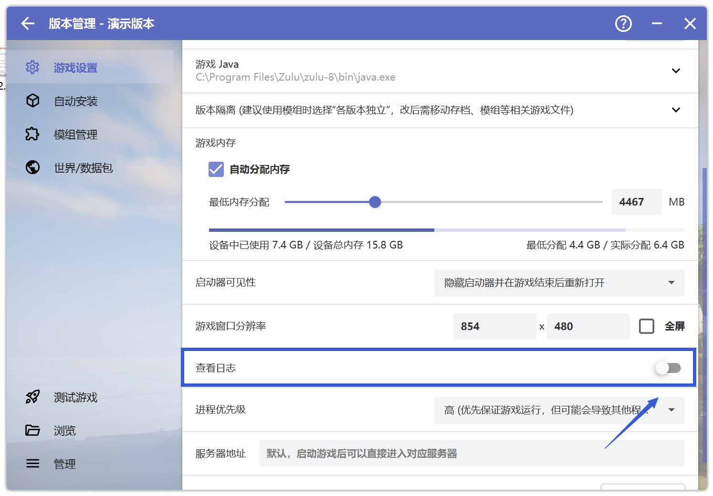

# 打开'查看日志'问题

## 如何打开"查看日志"

首先打开HMCL启动器，点击"版本管理"

 

 

**请先确保你在"版本管理"中选中了出现问题的游戏版本**

点击"启用版本特定游戏设置（不影响其他游戏版本）"，一直往下划，打开"查看日志"

 

 

启动游戏后，你就可以看到"日志"窗口和你的游戏窗口，如下图

 

 

如果你收到了下图的指示，当你的日志界面不在滚动时(请开启"自动滚动")，点击日志界面的"导出游戏运行栈"，然后在新打开的文件夹页面，将导出的游戏栈文件发送到群内

 

 

**请确定你的游戏栈已经卡住(不滚动)1分钟及以上再导出游戏运行栈，发送至群内，供大夫分析！**

**若你对操作过程有任何疑问，请前往用户群询问，而不是崩溃群**

| 用户群       | 群号       | 用户群       | 群号       |
| ------------ | ---------- | ------------ | ---------- |
| HMCL 用户群 ① | 633640264  | HMCL 用户群 ② | 203232161  |
| HMCL 用户群 ③ | 201034984  | HMCL 用户群 ④ | 533529045  |
| HMCL 用户群 ⑤ | 744304553  | HMCL 用户群 ⑥ | 282845310  |
| HMCL 用户群 ⑦ | 482624681  | HMCL 用户群 ⑧ | 991620626  |
| HMCL 用户群 ⑨ | 657677715  | HMCL 用户群 ⑩ | 775084843  |