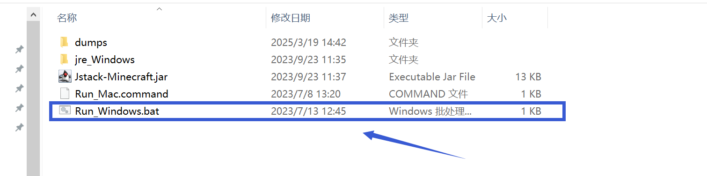
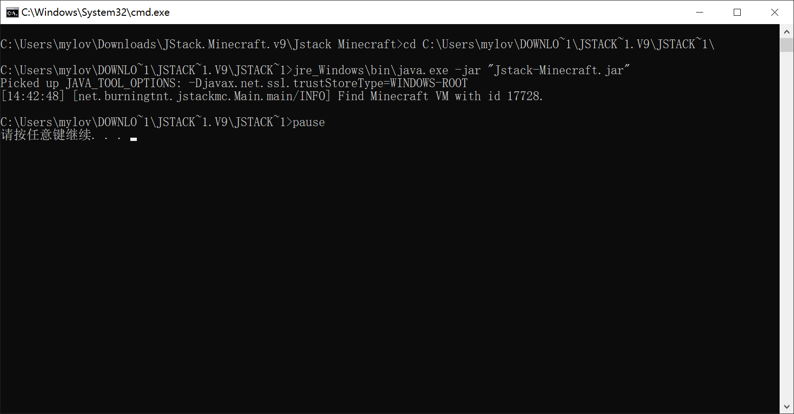

# 导出游戏运行栈不兼容

如果你遇到了导出游戏运行栈不兼容的情况，具体如下图，导出游戏运行栈的按钮为灰色

 

 

**请确定你的游戏栈已经卡住(不滚动)1分钟及以上再导出游戏运行栈，发送至群内，供大夫分析！**

则**不要退出游戏**，下载这个工具

 

https://cdn.crashmc.com/https://github.com/burningtnt/JStack-Minecraft/releases/download/V9/JStack.Minecraft.v9.zip 

 

然后**解压**下载下来的工具，打开文件夹，你可以看到以下几个文件，双击打开其中的"Run_Windows.bat"文件

**一定要解压!!!!!!!!**

 

 

当出现"请按任意键继续"时，会自动弹出一个文件夹，如果没有，前往工具的文件夹中找到"dumps"文件夹，并将文件夹中最新的日志文件发送到崩溃群，

**如果在打开"Run_Windows.bat"遇到其他的输出情况，而不是"请按任意键继续. . ."，请截图界面并发送到崩溃群询问**

**若你对操作过程有任何疑问，请前往用户群询问，而不是崩溃群**

| 用户群       | 群号       | 用户群       | 群号       |
| ------------ | ---------- | ------------ | ---------- |
| HMCL 用户群 ① | 633640264  | HMCL 用户群 ② | 203232161  |
| HMCL 用户群 ③ | 201034984  | HMCL 用户群 ④ | 533529045  |
| HMCL 用户群 ⑤ | 744304553  | HMCL 用户群 ⑥ | 282845310  |
| HMCL 用户群 ⑦ | 482624681  | HMCL 用户群 ⑧ | 991620626  |
| HMCL 用户群 ⑨ | 657677715  | HMCL 用户群 ⑩ | 775084843  |