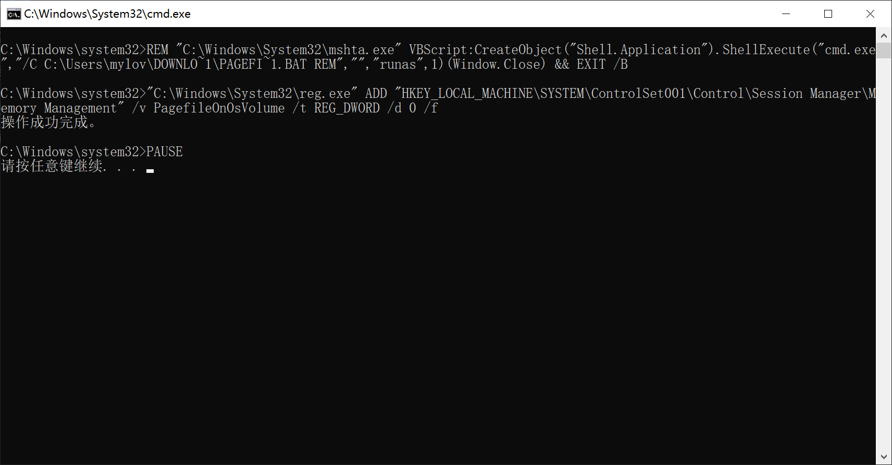
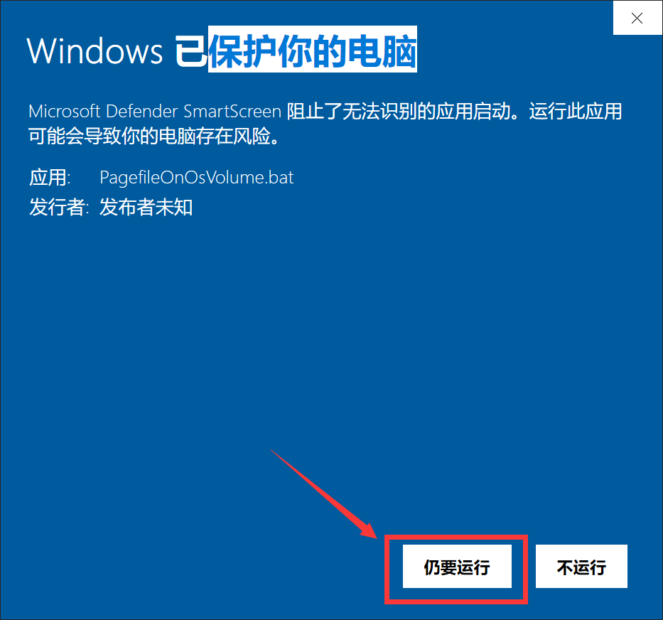
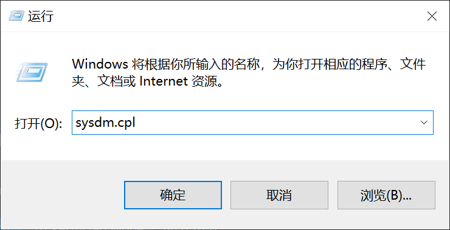
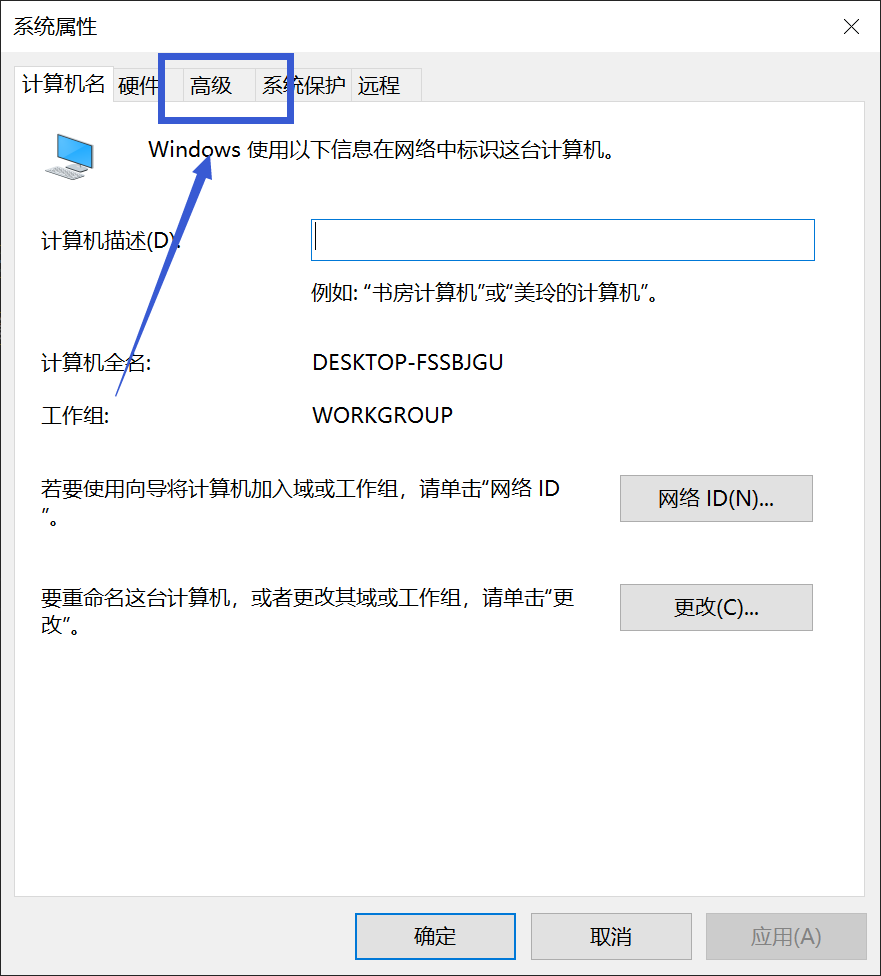
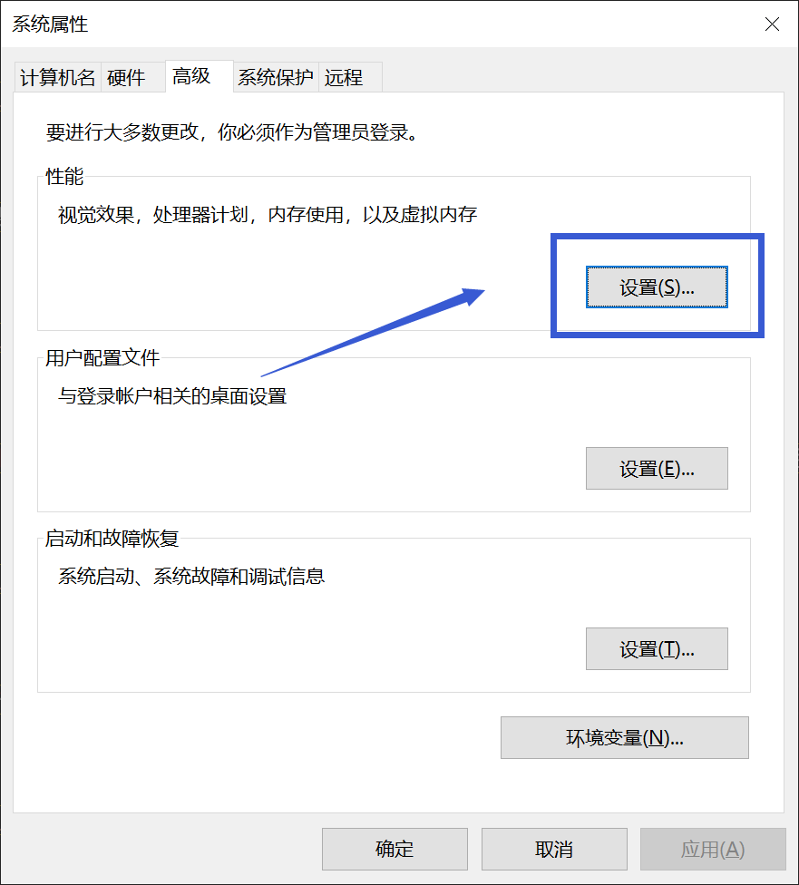
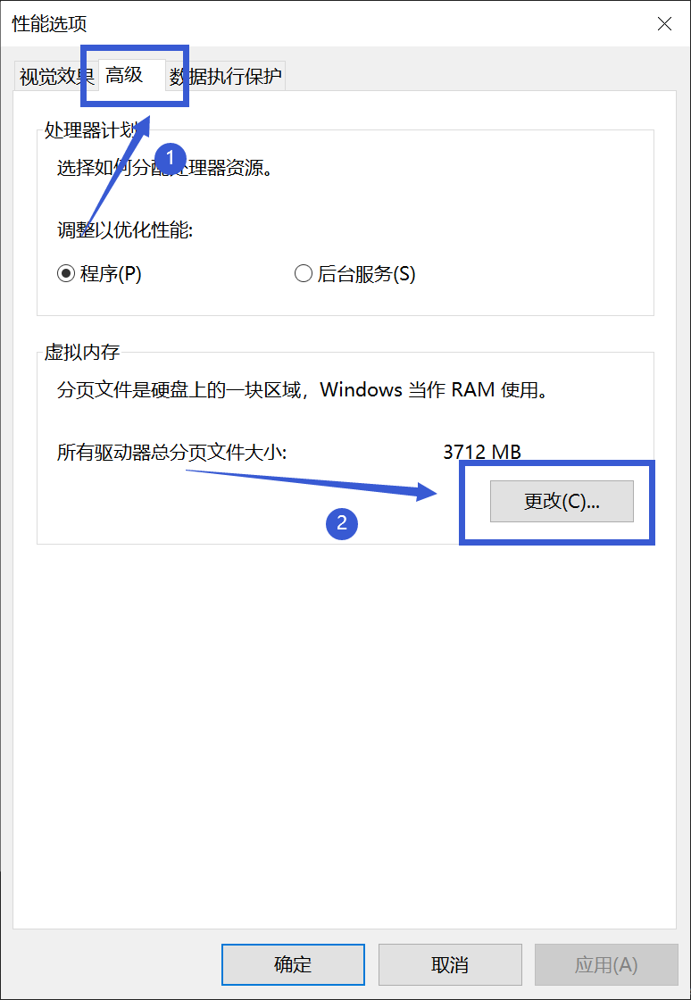
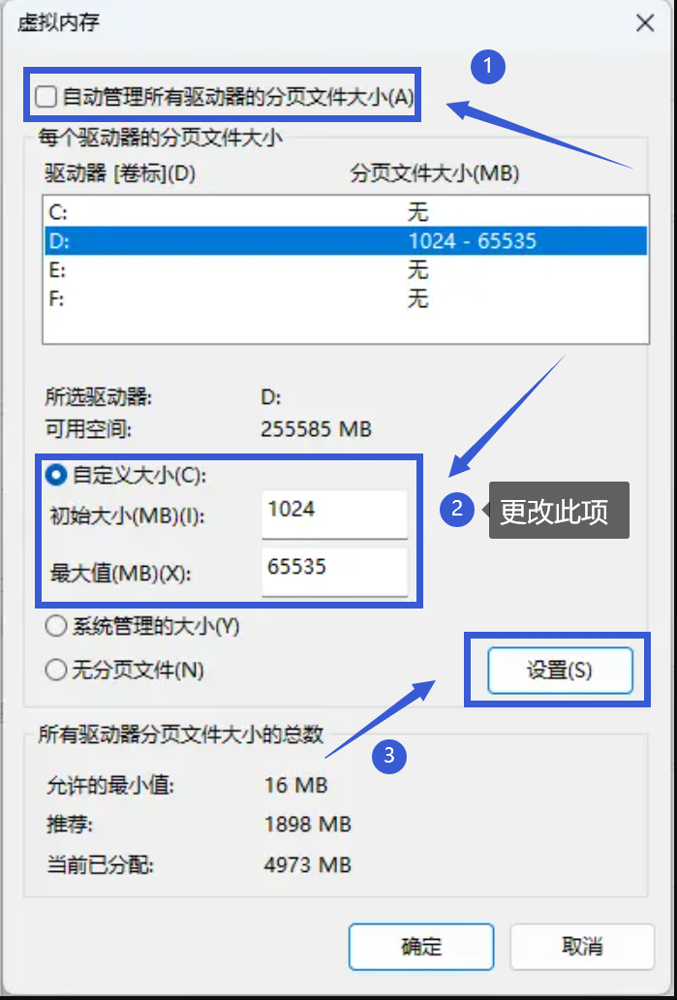
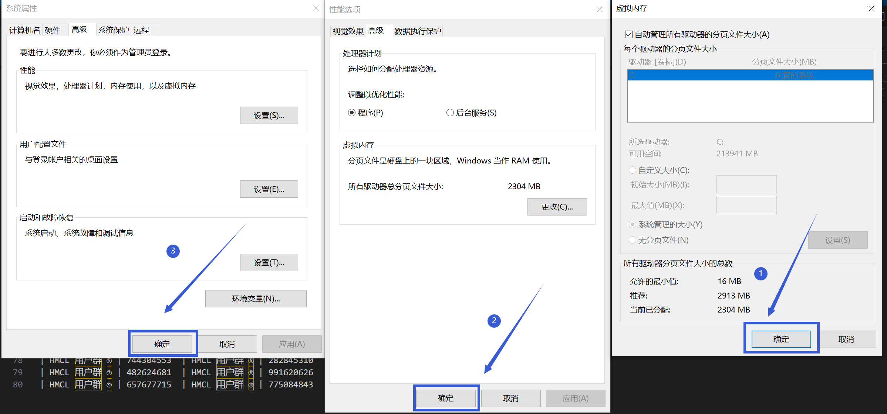

# 虚拟内存问题

## 如何添加虚拟内存

首先下载这个文件，双击打开运行

https://img.kookapp.cn/attachments/2025-02/12/67acc25dc5f06.bat 

当出现下面的界面的时候，说明运行已经完成

 

 

**如果出现了下图的界面，点击"更多信息"，再点击"仍要运行"

 

 

然后同时按下键盘上的Windows键和R键，打开"运行"窗口，并输入"sysdm.cpl"(不包括引号)，并按下回车，打开"系统数据管理器"

 

 

先点击最上方的"高级",再点击"性能"选项框内的"设置"

 

 

再新打开的窗口中点击最上面的"高级",点击"虚拟内存"选项框内的"更改"

 

 

在新打开的页面中，按照下图的顺序进行更改，先取消勾选"自动管理所有驱动器的分页文件大小"，再把虚拟内存换到其他剩余容量大于 80GB 的盘里，再在下方的"自定义大小中"，初始大小输入"1024"，最大值输入"65535"，再点击"设置"

 

 

**如果没有其他剩余容量大于 80GB 的盘，请截图并到崩溃群询问**

之后按下图的顺序依次点击"确定"，"确定"，"确定"，然后重启电脑。

 

 

**若你对操作过程有任何疑问，请前往用户群询问，而不是崩溃群**

| 用户群       | 群号       | 用户群       | 群号       |
| ------------ | ---------- | ------------ | ---------- |
| HMCL 用户群 ① | 633640264  | HMCL 用户群 ② | 203232161  |
| HMCL 用户群 ③ | 201034984  | HMCL 用户群 ④ | 533529045  |
| HMCL 用户群 ⑤ | 744304553  | HMCL 用户群 ⑥ | 282845310  |
| HMCL 用户群 ⑦ | 482624681  | HMCL 用户群 ⑧ | 991620626  |
| HMCL 用户群 ⑨ | 657677715  | HMCL 用户群 ⑩ | 775084843  |