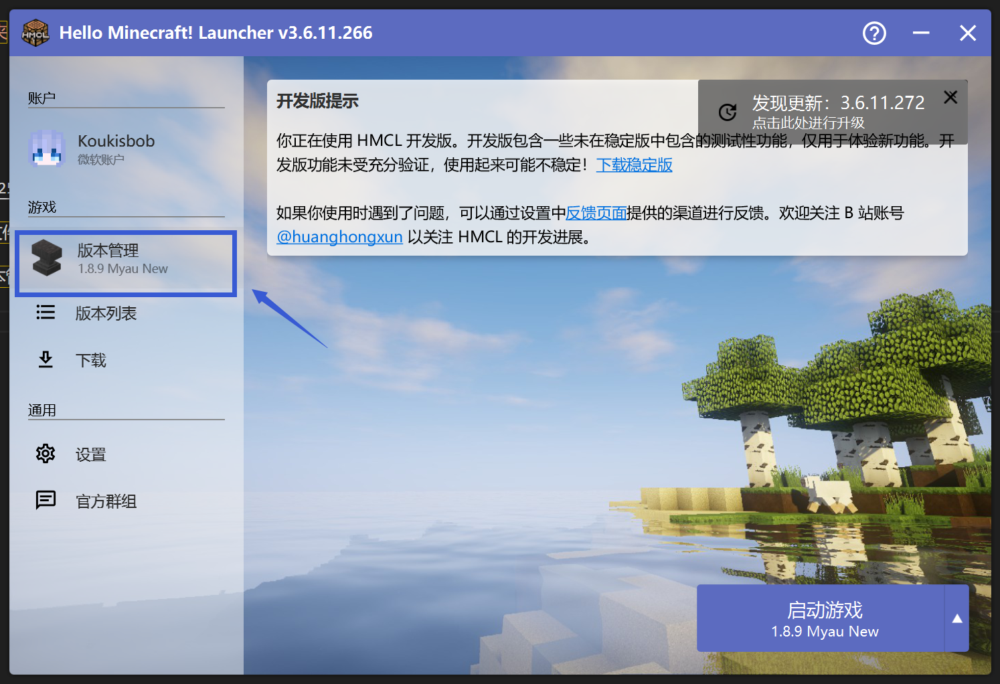
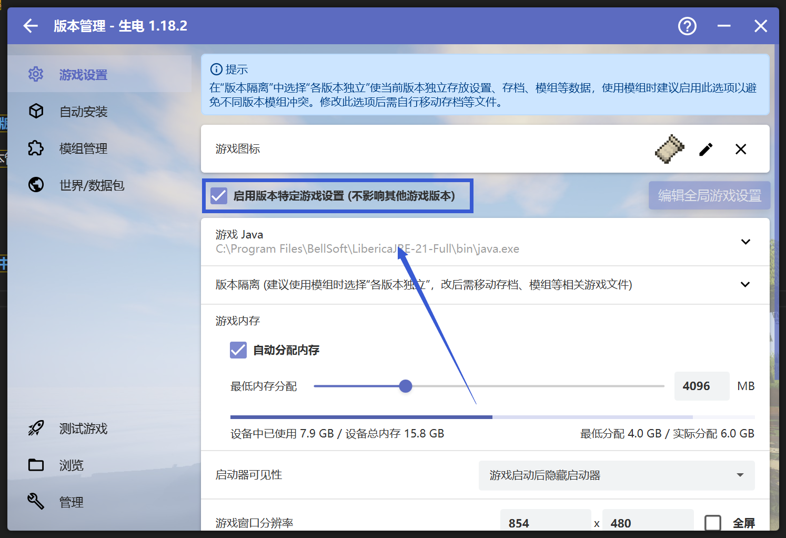
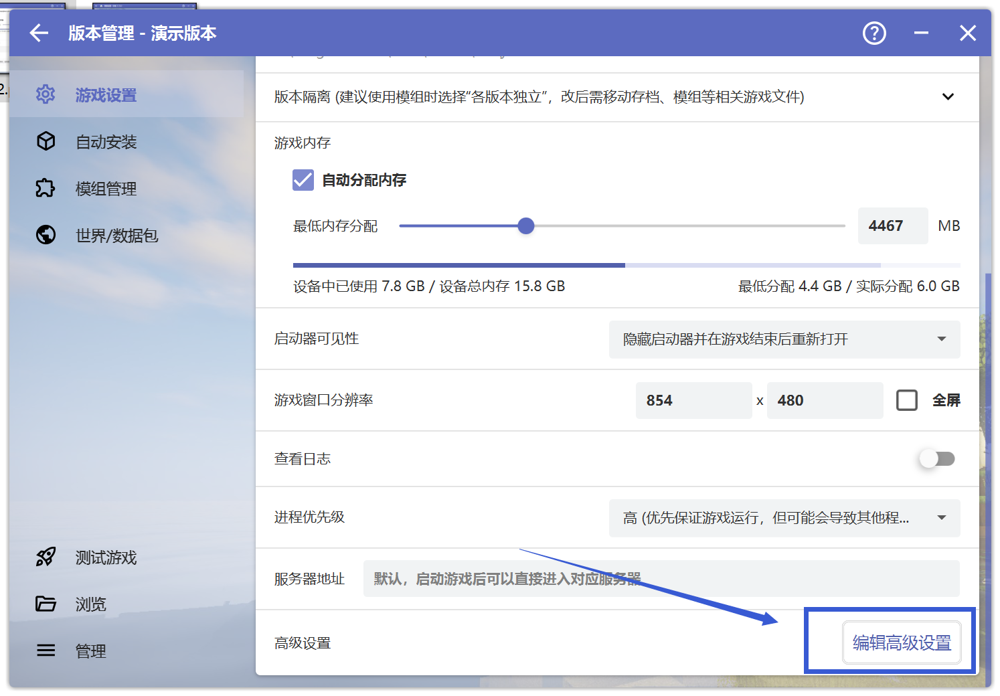
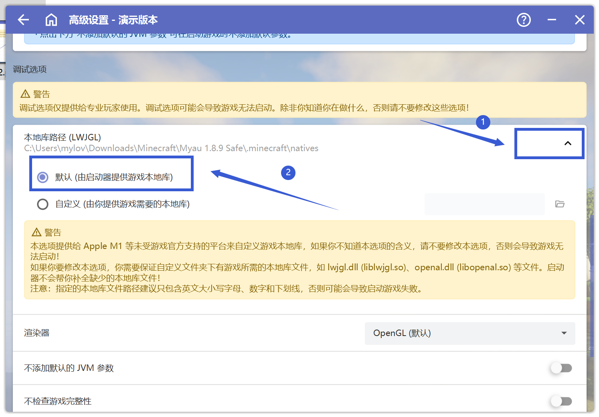

# 渲染 问题相关

## 本地库路径问题

首先打开HMCL启动器，点击"版本管理"
 

 

**请先确保你在"版本管理"中选中了出现问题的游戏版本**

点击"启用版本特定游戏设置（不影响其他游戏版本）"，一直往下划，点击"编辑高级设置"

 

 

进入"高级设置"，往下划，找到"本地库路径(LWJGL)"，展开后将路径切换为"默认"或"预设"

不同HMCL启动器版本可能不同，只要是"默认"或"预设"即可

 

 

