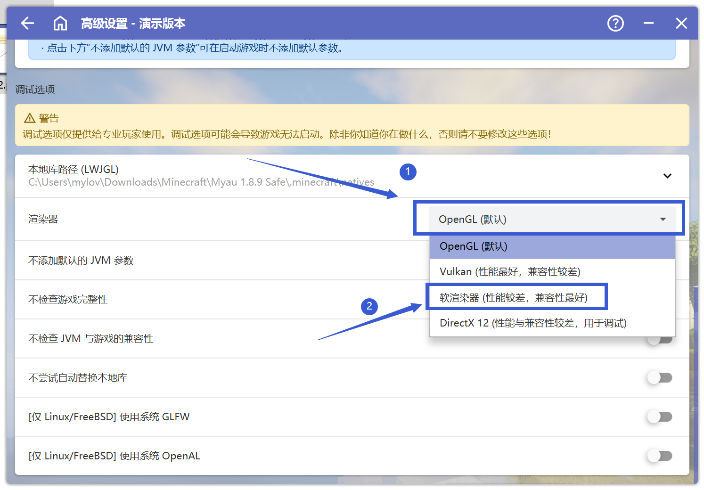

# 软渲染器问题

首先打开HMCL启动器，点击"版本管理"
 

 

**请先确保你在"版本管理"中选中了出现问题的游戏版本**

点击"启用版本特定游戏设置（不影响其他游戏版本）"，一直往下划，点击"编辑高级设置"

 

 

进入"高级设置"，往下划，找到"渲染器"，展开后将渲染器切换为"软渲染器"

 

 

**对于操作有疑问，请前往用户群询问，而不是在崩溃群**

| 用户群       | 群号       | 用户群       | 群号       |
| ------------ | ---------- | ------------ | ---------- |
| HMCL 用户群 ① | 633640264  | HMCL 用户群 ② | 203232161  |
| HMCL 用户群 ③ | 201034984  | HMCL 用户群 ④ | 533529045  |
| HMCL 用户群 ⑤ | 744304553  | HMCL 用户群 ⑥ | 282845310  |
| HMCL 用户群 ⑦ | 482624681  | HMCL 用户群 ⑧ | 991620626  |
| HMCL 用户群 ⑨ | 657677715  | HMCL 用户群 ⑩ | 775084843  |