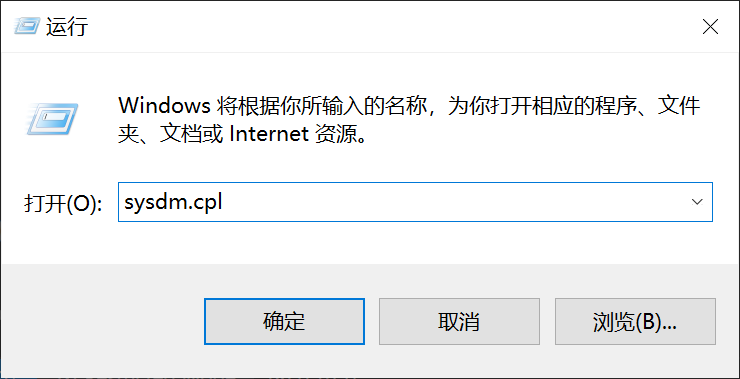
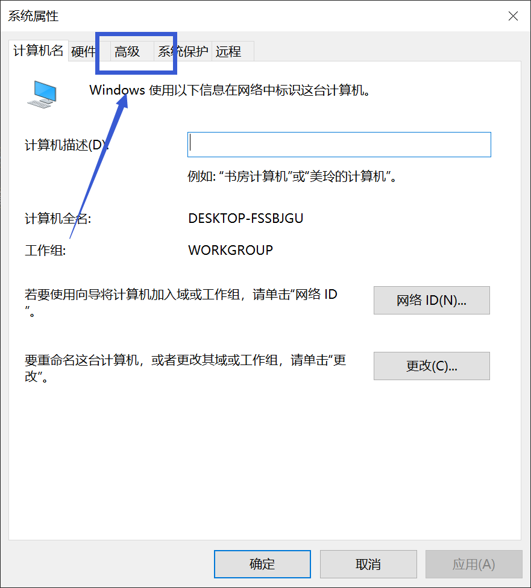
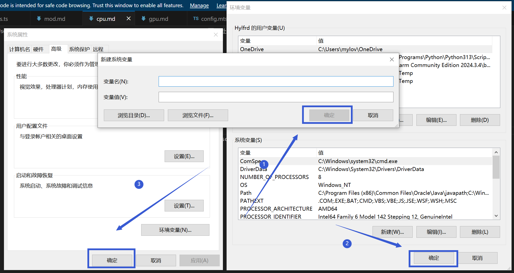

# 环境变量问题

## 如何添加环境变量

**此方法适用于从Windows XP到Windows 11之间的任何Windows系统,Macos等系统的方法请自行百度，且Macos等系统的环境变量与Windows不同，若有疑问请在崩溃群中询问**

首先同时按下键盘上的Windows键和R键，打开"运行"窗口，并输入"sysdm.cpl"(不包括引号)，并按下回车，打开"系统数据管理器"

 

 

先点击最上方的"高级",再点击最下方的"环境变量"

 

 

点击"系统变量"下方的"新建"(不要点上面"用户变量"的新建)，按照崩溃群的要求进行填写

 

 

填写完成后按下图依次点击"确定","确定","应用",最后重启电脑。

 

**请注意操作不一定能解决问题，若出现新问题请回到崩溃群。**

**若你对操作过程有任何疑问，请前往用户群询问，而不是崩溃群**

HMCL 用户群 ①: 633640264    HMCL 用户群 ②: 203232161 
HMCL 用户群 ③: 201034984    HMCL 用户群 ④: 533529045 
HMCL 用户群 ⑤: 744304553    HMCL 用户群 ⑥: 282845310 
HMCL 用户群 ⑦: 482624681    HMCL 用户群 ⑧: 991620626 
HMCL 用户群 ⑨: 657677715    HMCL 用户群 ⑩: 775084843 