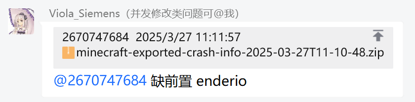
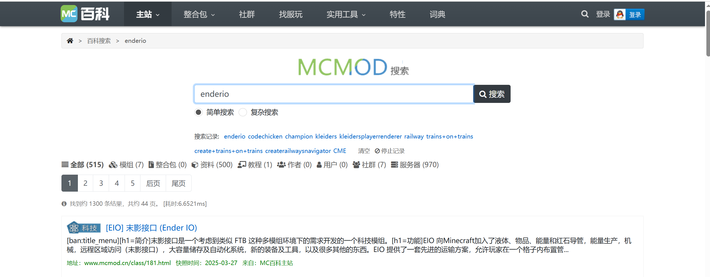
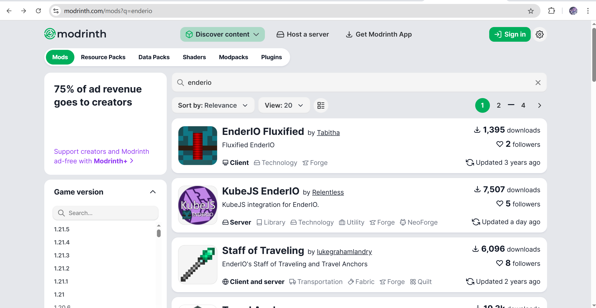
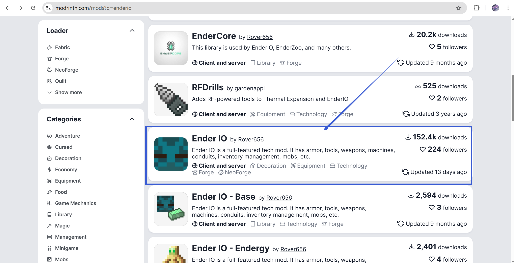
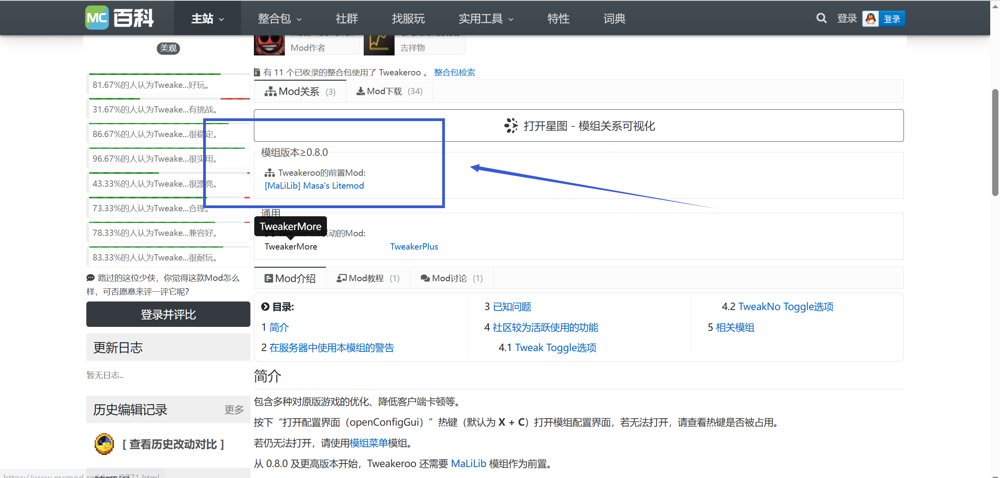
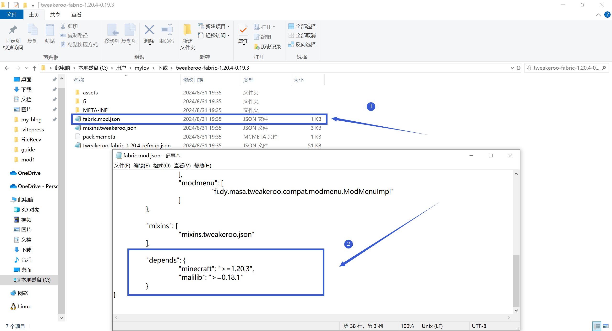
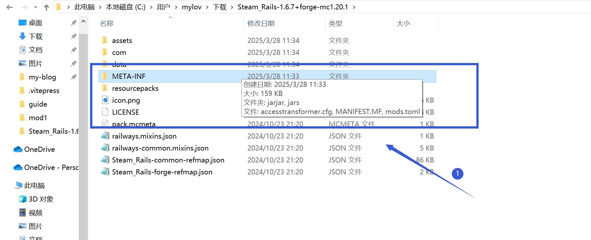
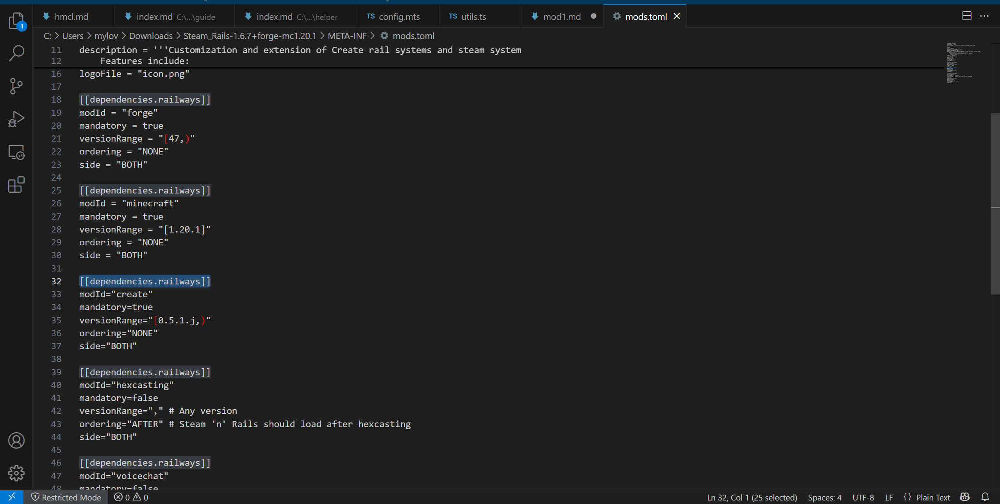

# 模组前置问题

**如果你不知道如何寻找安装或寻找正确的前置，或在此篇中的任何步骤遇到非崩溃问题，请前往用户群询问！请不要在崩溃群询问任何有关模组前置的问题**

| 用户群       | 群号       | 用户群       | 群号       |
| ------------ | ---------- | ------------ | ---------- |
| HMCL 用户群 ① | 633640264  | HMCL 用户群 ② | 203232161  |
| HMCL 用户群 ③ | 201034984  | HMCL 用户群 ④ | 533529045  |
| HMCL 用户群 ⑤ | 744304553  | HMCL 用户群 ⑥ | 282845310  |
| HMCL 用户群 ⑦ | 482624681  | HMCL 用户群 ⑧ | 991620626  |
| HMCL 用户群 ⑨ | 657677715  | HMCL 用户群 ⑩ | 775084843  |

## 什么是模组前置

模组前置是为其他模组提供必要依赖库或基础功能的辅助模组，通常包含核心代码或API，确保主体模组能正常运行

若一个模组需要另一个模组作为前置，而你没有安装这个前置，极大可能会导致游戏崩溃

## 如何下载前置

### 若你知道了缺失的前置的名字

以下为HMCL崩溃群中，缺前置"enderio"为示例：

 

 

在**绝大多数情况**下，崩溃群提供的前置名一般为**类名**或**ModID**，而不是模组名称

你需要将名字在以下网站进行搜索

**mcmod.cn** : 如果是类名或ModID：搜索出来的结果的名字不一定准确，如下图中"Ender IO"即为我们需要安装的模组

请注意mcmod因为搜索策略的原因，直接搜索类名或ModID可能找不到对应的模组，你需要使用下面其他的方式

 

 

**modrinth.com** : 网站全英文，请自己使用翻译工具，但因为搜索策略的问题，搜索出的第一个模组不一定为需要安装的模组，如下图

 

 

有些情况你需要往下滑才能找到正确的模组

 

 

**curseforge.com** : 网站全英文，请自己使用翻译工具，但有些模组在modrinth收录，在curseforge没有收录，请自行查找

 

**问AI** ： 如今的技术如此发达，有时候问AI也是一个好的办法

 

 

### 若你不知道缺失的前置的名字

**mcmod.cn** 是目前较好的查看模组前置的网站，下面以tweakeroo为例：

 

 

我们在图中即可确认tweakeroo模组需要MaLiLib作为前置

**问AI** ： 如今的技术如此发达，有时候问AI也是一个好的办法

 

 

**手动查询模组需要的前置** : 首先下载你需要知道的模组，此处以tweakeroo-fabric-1.20.4-0.19.3为例

下载好模组后解压，打开文件夹，打开其中的fabric.mod.json文件(记事本即可打开)

找到depends项，即可找到需要的前置以及对应的版本

 

 

forge模组以Steam_Rails-1.6.7+forge-mc1.20.1为例

下载好模组后解压，打开文件夹，打开META-INF文件夹，打开mods.toml文件，以记事本即可打开，此处使用VSC打开

我们在dependencies选项即可看到模组需要的前置以及对应版本

## 如何安装前置

在你下载好了正确的前置版本之后，只需要将前置模组正确添加到你游玩的游戏版本中即可

这与添加其他模组的方法是相同的，此处不在赘述，你可以通过百度搜索或前往用户群询问解决这一问题