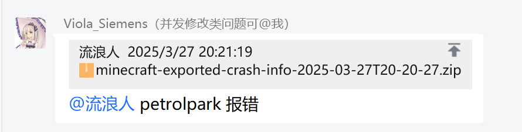
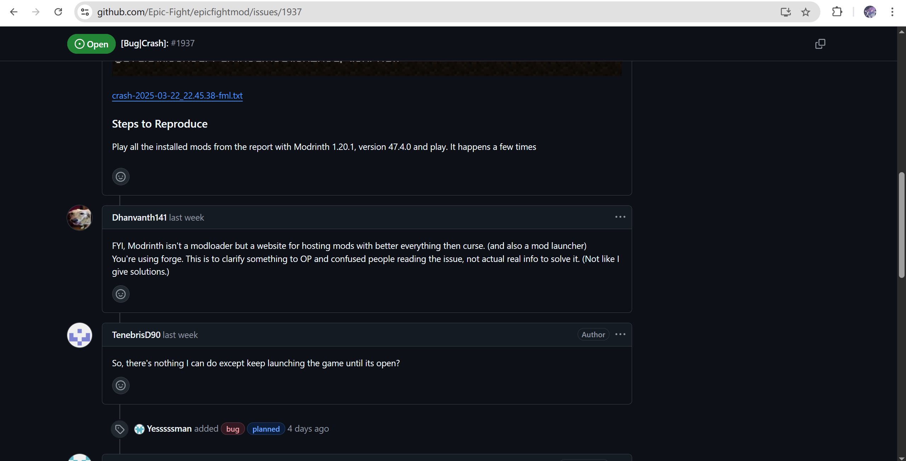

# 模组报错问题

**和此篇有关的任何问题，请前往用户群询问！请不要在崩溃群询问任何有关模组报错的问题**

| 用户群       | 群号       | 用户群       | 群号       |
| ------------ | ---------- | ------------ | ---------- |
| HMCL 用户群 ① | 633640264  | HMCL 用户群 ② | 203232161  |
| HMCL 用户群 ③ | 201034984  | HMCL 用户群 ④ | 533529045  |
| HMCL 用户群 ⑤ | 744304553  | HMCL 用户群 ⑥ | 282845310  |
| HMCL 用户群 ⑦ | 482624681  | HMCL 用户群 ⑧ | 991620626  |
| HMCL 用户群 ⑨ | 657677715  | HMCL 用户群 ⑩ | 775084843  |

**模组报错**指的是模模组因为自身的问题（包括自身的bug或其他原因）导致游戏崩溃，这在大部分情况下都是作者编写模组时出现的问题，而不是游戏环境或其他模组造成的问题

以下为来自崩溃群的例子：

 

 

对于模组报错的情况，有两种常见的解决方法：

**升级** 你可以尝试查找报错的模组是否有更新的版本，如果有，你可以升级模组，模组作者可能在最新的版本中解决了这一问题

 

**禁用** 在升级无果的情况下，你只能放弃该模组，将该模组**禁用**（不要删除），来以求游戏正常运行

 

**一些特殊情况** ：

1：报错的模组为核心模组：如pixelmon模组在1.16.5在MacOS系统下完全无法运行，而游戏的主要玩法为宝可梦

**解决方案** ： 没有解决方案，你可能需要换Windows系统来游玩这个模组，核心模组报错一般意味着你只能放弃游玩这个整合包

2：报错的模组为前置库：如creativemd报错

**解决方案** ： 你需要将以creativemd为前置的所有模组全部禁用

 

**进阶方案(需要英语水平与一定电脑使用水平)** 你可以前往模组的对应github仓库(前提是得有)，前往issue查看是否有同样的报错出现，作者是否有给出解决方案

如Epic Fight模组在sided_setup event遇到的CME并发修改报错，作者就明确回复了在下一个版本会进行修复

 

