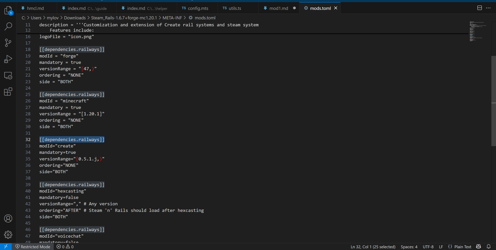
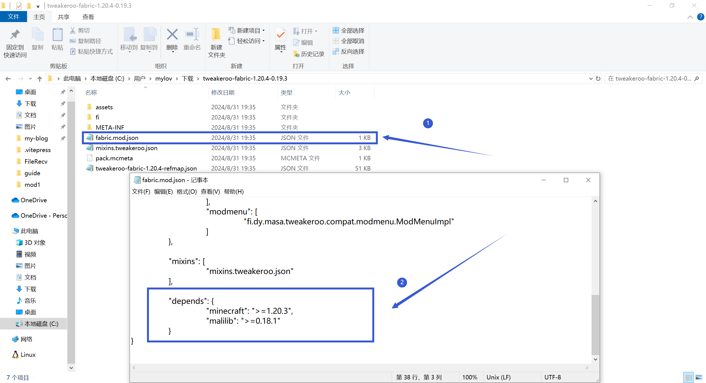

# 模组版本匹配问题

**如果你不知道如何寻找匹配的版本，或在此篇中的任何步骤遇到非崩溃问题，请前往用户群询问！请不要在崩溃群询问任何有关模组版本匹配的问题**

| 用户群       | 群号       | 用户群       | 群号       |
| ------------ | ---------- | ------------ | ---------- |
| HMCL 用户群 ① | 633640264  | HMCL 用户群 ② | 203232161  |
| HMCL 用户群 ③ | 201034984  | HMCL 用户群 ④ | 533529045  |
| HMCL 用户群 ⑤ | 744304553  | HMCL 用户群 ⑥ | 282845310  |
| HMCL 用户群 ⑦ | 482624681  | HMCL 用户群 ⑧ | 991620626  |
| HMCL 用户群 ⑨ | 657677715  | HMCL 用户群 ⑩ | 775084843  |

## 什么是版本匹配问题

部分模组需要前置模组运行的同时，对前置模组有严格的版本要求

例如Steam_Rails-1.6.7+forge-mc1.20.1则严格要求create模组的0.5.1.j版本才能正常运行

而当模组的版本不匹配则会导致运行问题

## 如何解决版本匹配问题

**首要逻辑：附属版本匹配核心模组版本**

以下以create和railways版本作为模组版本匹配的示例：

 

 

从mcmod.cn或其他渠道，我们可以知道，railways(即模组Steam_Rails)需要create(即模组机械动力)作为前置

我们则可以确定，create为核心模组，我们需要调整附属模组railways的版本来使两者的版本进行匹配

确定了思路之后，我们则可以寻找正确的railways版本：

### 方法1：在模组主页进行信息查找：

我们在mcmod.cn和modrinth.com查找railways的模组信息，均可以找到当前railways的版本匹配情况：

 

 

我们可以看到，最新的railways模组**仅支持到create 0.5.1j版本**，这意味着如果你想要游玩railways模组，你只能在create 0.5.1j的版本下游玩(截至2025年3月28日)

此时你有两个选择：

1：**(不建议)** 将create版本更改为create 0.5.1.j，并调整**所有**create模组的附属模组，让所有的模组匹配create 0.5.1j
 
2：移除railways模组

### 方法2：在模组本体内查找（技术向）

在某些情况下，作者可能没有在模组介绍页声明需要的对应前置或匹配的模组版本

而在99.9%的情况下，模组的本体文件内都会声明需要的模组

（如果没有就说明这个作者瞎写模组）

以下提供可行的方法，查找模组需要的匹配模组，仍以railways模组作为举例：

#### forge模组:以Steam_Rails-1.6.7+forge-mc1.20.1作为示例

下载Steam_Rails-1.6.7+forge-mc1.20.1模组，使用**压缩软件**解压模组，你会得到一个文件夹

forge模组的声明保存在mods.toml文件内，打开META-INF文件夹，打开mods.toml文件，以记事本即可打开，此处使用VSC打开

 

 

我们在dependencies选项即可看到模组需要的前置以及对应版本

#### fabric模组:以tweakeroo-fabric-1.20.4-0.19.3作为示例

下载tweakeroo-fabric-1.20.4-0.19.3模组，使用**压缩软件**解压模组，你会得到一个文件夹

打开文件夹，打开其中的fabric.mod.json文件(记事本即可打开)

找到depends项，即可找到需要的前置以及对应的版本

 

 