# 模组下载 网络问题相关

## 方法一：使用USBEAm 

### Optifine/Farbicmc/Modrinth/Neoforge/MinecraftForge

前往网站 https://www.dogfight360.com/blog/ 下载USBEAm最新版

或使用直链链接下载 https://wwid.lanzouw.com/igHUi2mhbqdc 下载USBEAm 4.0.1版本

以下教程使用USBeAm 4.0.1版本进行演示

下载后你会得到一个压缩包，**解压后**打开压缩包内的"USBEAm Hosts Editor.exe"应用程序

打开运行后，点击最下角的游戏手柄图标，点击"搜索hosts规则"，搜索"我的世界MOD"，点击下方的"我的世界MOD optifine/fabricmc/modrinth/neoforged/minecraftforge"

 

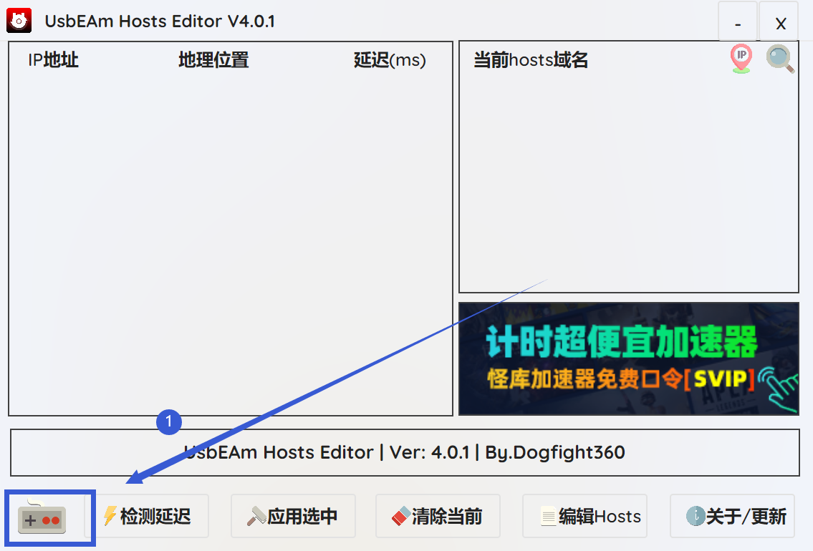
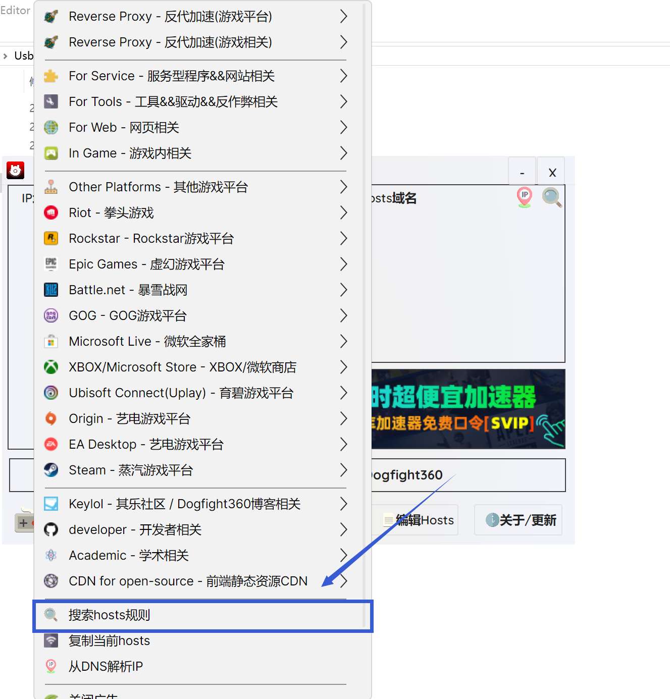
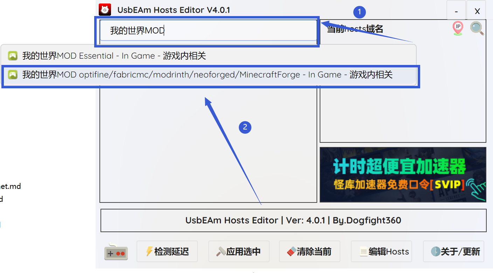

 

然后按下图的操作顺序，先点击"检测延迟"，再选中上方延迟最低的Host节点，最后点击"应用选中"

 

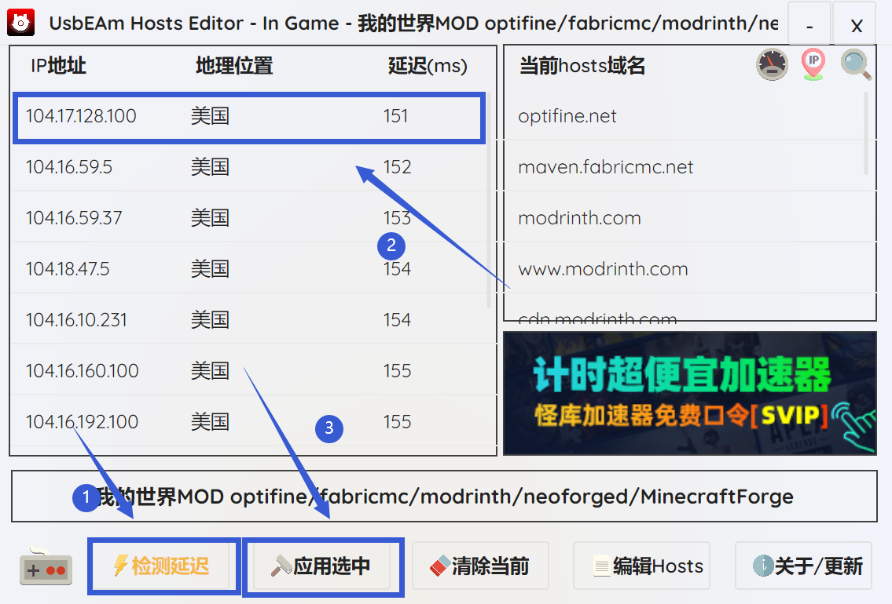

 

USBEAm基于修改Host，效果可能不稳定，如果仍然出现问题，请尝试切换节点，使用热点连接，或使用方法二

### CurseForge 

前往网站 https://www.dogfight360.com/blog/ 下载USBEAm最新版

或使用直链链接下载 https://wwid.lanzouw.com/igHUi2mhbqdc 下载USBEAm 4.0.1版本

以下教程使用USBeAm 4.0.1版本进行演示

下载后你会得到一个压缩包，**解压后**打开压缩包内的"USBEAm Hosts Editor.exe"应用程序

打开运行后，点击最下角的游戏手柄图标，点击"搜索hosts规则"，搜索"我的世界MOD"，点击下方的"我的世界MOD optifine/fabricmc/modrinth/neoforged/minecraftforge"

 

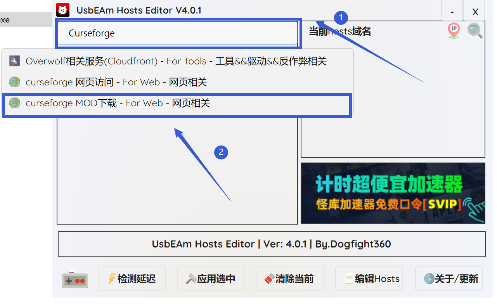

 

然后按下图的操作顺序，先点击"检测延迟"，再选中上方延迟最低的Host节点，最后点击"应用选中"

 

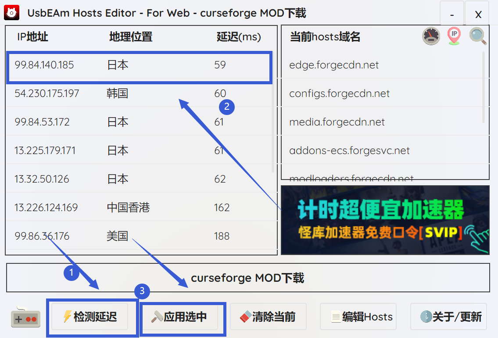

 

USBEAm基于修改Host，效果可能不稳定，如果仍然出现问题，请尝试切换节点，使用热点连接，或使用方法二

## 方法二：使用VPN/代理工具

VPN工具使用与传播违法，以下仅提供一种可行的免费代理方法

选择以下任意链接下载Clash客户端：

下载链接一：https://gh-proxy.com/https://github.com/Z-Siqi/Clash-for-Windows_Chinese/releases/download/CFW-V0.20.39_OPT-1/Clash.for.Windows.Setup.0.20.39_Opt-1.exe

下载链接二：https://download.三分互联.com/Clash.for.Windows.Setup.0.20.39_Opt-1.exe

（如果这两个链接都挂了联系QQ : 3553841566）

然后安装下载的程序，前往这个网站 https://ikuuu.pw （注：梯子官网域名随时被墙，具体请以实际显示为准）注册一个账号并登录

（此处提供的是免费代理，如果你自己拥有代理服务你可以使用自己的）

登录后在首页往下划，找到"便携导入"，点击"Clash 订阅链接"，点击"复制 Clash 订阅链接"

 

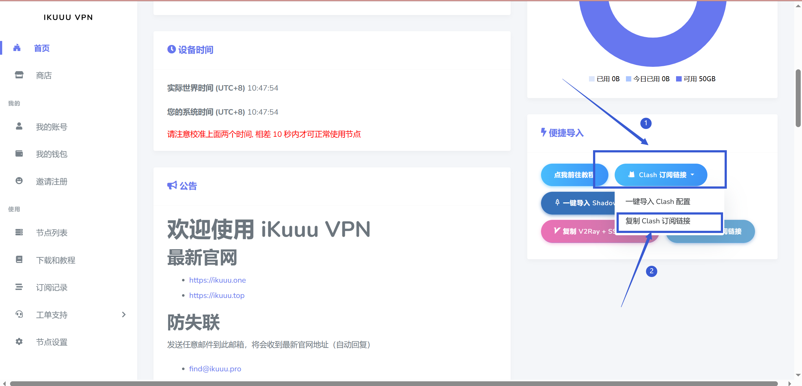

 

打开刚刚安装的程序，按下图中的操作顺序，先打开"服务模式"右侧的"管理"选项，安装"服务管理组件"，再打开"IPV6"、"系统代理"和"TUN 模式"选项，

然后点击左侧的"配置"选项，在上方的输入栏处点击右边的"粘贴"图标，并点击"下载"，出现如图所示的选中配置的样子就表示导入成功，导入成功后点击左侧的"代理"选项

 

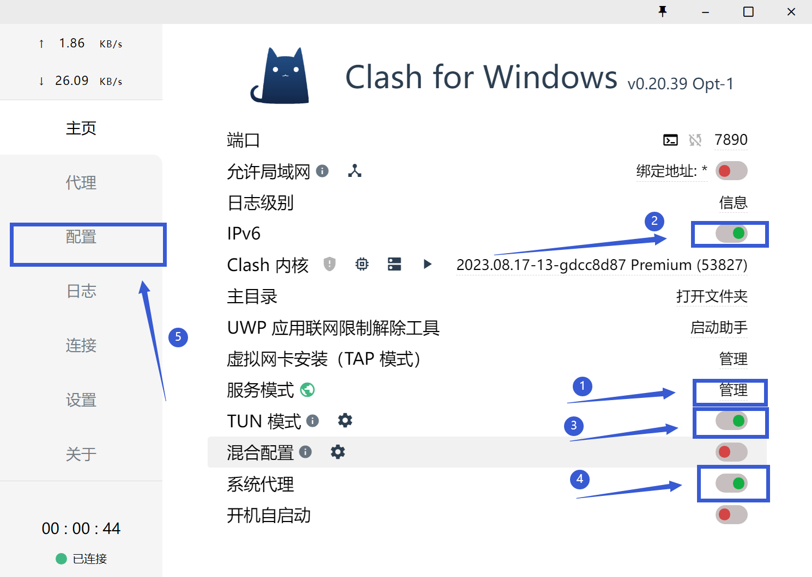
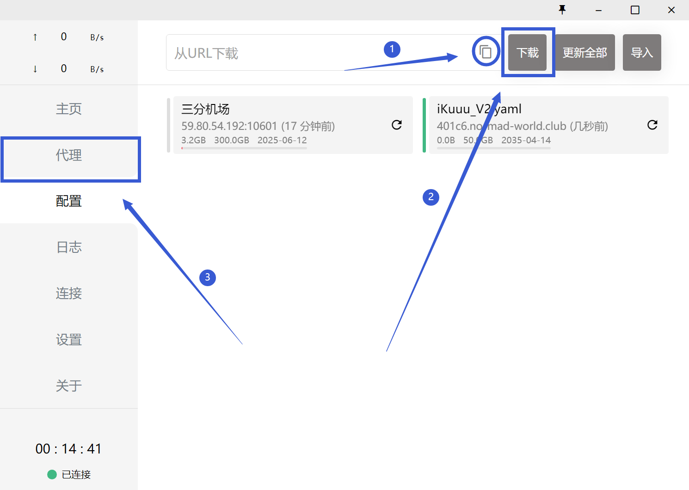

 

在"代理"页面，点击下图所示的"测试延迟"图标，双击选中延迟最低的节点即可 **不要点DIRECT**

 

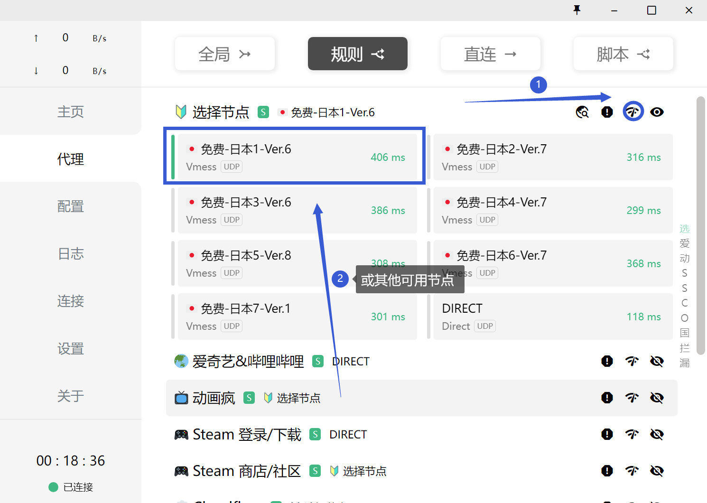

 

正常情况下，代理已经可以正常使用，你可以访问网站 myip.bili33.top 往下划找到"网站连通性"选项

如果Youtube以及Google提示可用，说明代理已经连接完成

 

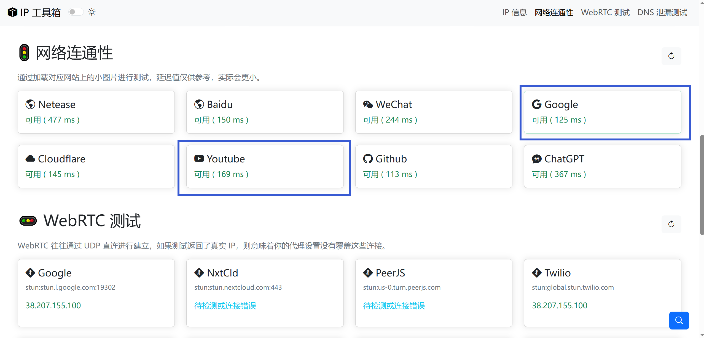

 

**请注意** ： 提供的代理为免费代理，稳定性欠佳，请关注官网以查询代理状态

## 其他情况 

如果你是校园网，政府单位内网络，使用长城宽带或其他情况，采取以上方法后仍然无法解决问题，这说明你所在的运营商把所需要连接到的外网地址全部屏蔽

你只能尝试更改网络环境，比如换个地方（物理意义上的）