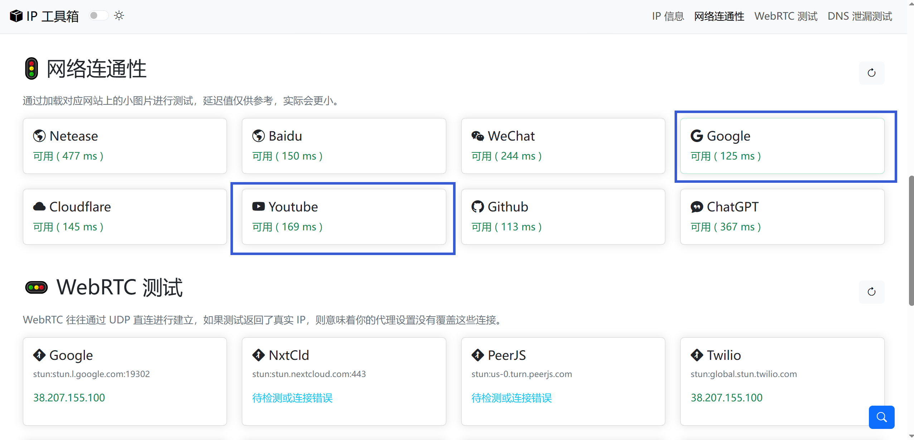

# 代理工具的一种可行方法

VPN工具使用与传播违法，以下仅提供一种可行的免费代理方法

选择以下链接下载Clash客户端：

https://github.com/Z-Siqi/Clash-for-Windows_Chinese/releases/download/CFW-V0.20.39_OPT-1/Clash.for.Windows.Setup.0.20.39_Opt-1.exe

上面那个链接慢可以用这个 https://gh-proxy.com/https://github.com/Z-Siqi/Clash-for-Windows_Chinese/releases/download/CFW-V0.20.39_OPT-1/Clash.for.Windows.Setup.0.20.39_Opt-1.exe

然后安装下载的程序，前往这个网站 https://ikuuu.pw （注：梯子官网域名随时被墙，具体请以实际显示为准）注册一个账号并登录

（此处提供的是免费代理，如果你自己拥有代理服务你可以使用自己的）

登录后在首页往下划，找到"便携导入"，点击"Clash 订阅链接"，点击"复制 Clash 订阅链接"

 

 

打开刚刚安装的程序，按下图中的操作顺序，先打开"服务模式"右侧的"管理"选项，安装"服务管理组件"，再打开"IPV6"、"系统代理"和"TUN 模式"选项，

 

 

然后点击左侧的"配置"选项，在上方的输入栏处点击右边的"粘贴"图标，将刚刚从网站获取到的 Clash 订阅链接 粘贴进去，并点击"下载" 
出现如图所示的选中配置的样子就表示导入成功，导入成功后点击左侧的"代理"选项

 

 

在"代理"页面，点击下图所示的"测试延迟"图标，双击选中延迟最低的节点即可 **不要点DIRECT**

 

 

正常情况下，代理已经可以正常使用，你可以访问网站 myip.bili33.top 往下划找到"网站连通性"选项

如果Youtube以及Google提示可用，说明代理已经连接完成

 

 